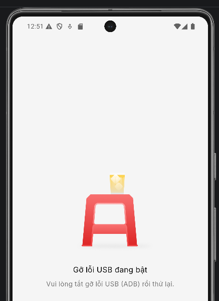

# V-app

# Mục tiêu

- [x]  Bypass layer java
- [ ]  Bypass layer native
- [ ]  Bắt được request
- Bởi vì đây là app production, sử dụng flutter. Nhưng pentest dựa trên emulator, các tool chỉ hỗ trợ arm. Do đó, không thể sử dụng tool để phân tích offset cũng như lấy lại symbol. Sẽ bổ sung khi vào tiếp giai đoạn 2 bằng cách mua 1 em máy thật :Vv

# Phân tích

## Java layer

- App này cho phép sử dụng thoải mái frida nhưng sẽ có nhiều tầng detect những thứ khác



- Thử search `adb, adb_enable` thì thấy được package với name `com.absolutions.security_plus` , nơi đây chứa tất cả các check ở layer java


## Intent

- Sau khi hook vào các hàm ở đâu nhưng vẫn không vào được màn đăng nhập
- Sau khi hỏi các anh mentor thì các anh có hint thêm như sau


- Sau khi seach các strings liên quan tới intent thì có khá là nhiều. Chuyển sang dùng script để dò intent

```jsx
Java.perform(function () {

    function log(msg) {
        console.log(msg);
    }

    function safe(v) {
        try {
            return String(v);
        } catch (_) {
            return "<err>";
        }
    }

    function dumpIntent(intent) {

        if (!intent) {
            log("Intent=null");
            return;
        }

        try { log("action    : " + intent.getAction()); } catch (_) {}
        try { log("package   : " + intent.getPackage()); } catch (_) {}
        try { log("component : " + intent.getComponent()); } catch (_) {}
        try { log("data      : " + intent.getDataString()); } catch (_) {}
        try { log("type      : " + intent.getType()); } catch (_) {}

        try {
            let cats = intent.getCategories();
            if (cats)
                log("categories: " + cats.toString());
        } catch (_) {}

        try {

            let extras = intent.getExtras();

            if (extras) {

                let keys = extras.keySet().toArray();

                for (let i = 0; i < keys.length; i++) {

                    let k = keys[i];

                    try {
                        log("extra[" + k + "] = " + safe(extras.get(k)));
                    } catch (_) {}
                }
            }

        } catch (_) {}
    }

    function tryDumpArg(arg) {

        if (!arg)
            return;

        try {

            if (arg.$className === "android.content.Intent") {

                log("---- Intent ----");
                dumpIntent(arg);
            }

        } catch (_) {}
    }

    function hookAll(className, methodName) {

        try {

            let Cls = Java.use(className);

            if (!Cls[methodName])
                return;

            Cls[methodName].overloads.forEach(function (ov) {

                ov.implementation = function () {

                    log("\n==============================");
                    log(className + "." + methodName);

                    for (let i = 0; i < arguments.length; i++) {

                        try {
                            log("arg" + i + ": " + safe(arguments[i]));
                        } catch (_) {}

                        tryDumpArg(arguments[i]);
                    }

                    return ov.apply(this, arguments);
                };
            });

            log("[+] Hooked " + className + "." + methodName);

        } catch (e) {}
    }

    /*
     * Intent constructors
     */
    hookAll("android.content.Intent", "$init");

    /*
     * Intent mutation
     */
    [
        "setAction",
        "setPackage",
        "setComponent",
        "setClass",
        "setClassName",
        "setData",
        "setDataAndType",
        "setType",
        "putExtra",
        "addCategory",
        "addFlags",
        "setFlags",
        "fillIn"
    ].forEach(function (m) {
        hookAll("android.content.Intent", m);
    });

    /*
     * Context APIs
     */
    [
        "startActivity",
        "startActivities",
        "startService",
        "startForegroundService",
        "bindService",
        "sendBroadcast",
        "sendOrderedBroadcast",
        "registerReceiver"
    ].forEach(function (m) {
        hookAll("android.content.ContextWrapper", m);
    });

    /*
     * PackageManager
     */
    [
        "resolveActivity",
        "queryIntentActivities",
        "resolveService",
        "queryIntentServices",
        "queryBroadcastReceivers"
    ].forEach(function (m) {
        hookAll(
            "android.app.ApplicationPackageManager",
            m
        );
    });

    /*
     * PendingIntent
     */
    [
        "getActivity",
        "getActivities",
        "getService",
        "getBroadcast",
        "send"
    ].forEach(function (m) {
        hookAll("android.app.PendingIntent", m);
    });

    /*
     * Activity receive
     */
    hookAll("android.app.Activity", "getIntent");
    hookAll("android.app.Activity", "onNewIntent");

    /*
     * Service receive
     */
    hookAll("android.app.Service", "onStartCommand");
    hookAll("android.app.Service", "onBind");

    /*
     * IntentFilter
     */
    hookAll("android.content.IntentFilter", "matchAction");

    log("[+] Intent Recon Ready");
});
```

- Mục đích chính của script này
    - Xem Intent được tạo như thế nào
    - Xem dữ liệu nào được đưa vào intent
    - Xem Intent được gửi đi đâu
    - Xem Intent được nhận ở đâu
    - Xem PackageManager resolve Intent như thế nào
- Sau khi chạy script sẽ có được log như sau

```html
android.content.Intent.$init
arg0: TALSEC_INFO

==============================
android.content.Intent.setAction
arg0: TALSEC_INFO

==============================
android.content.Intent.putExtra
arg0: INFO_DATA
arg1: emulator
==============================
android.content.Intent.setClassName
arg0: com.tsng.hidemyapplist
arg1: com.tsng.hidemyapplist.MainActivityLauncher

==============================
android.content.ContextWrapper.startActivity
arg0: Intent { cmp=com.tsng.hidemyapplist/.MainActivityLauncher }
---- Intent ----
action    : null
package   : null
component : ComponentInfo{com.tsng.hidemyapplist/com.tsng.hidemyapplist.MainActivityLauncher}
data      : null
type      : null

==============================
android.content.Intent.$init
arg0: TALSEC_INFO

==============================
android.content.Intent.setAction
arg0: TALSEC_INFO

==============================
android.content.Intent.putExtra
arg0: INFO_DATA
arg1: root

```

- Trong log trên có `TALSEC_INFO`  là dấu hiệu của [Talsec](https://www.talsec.app/) (**RASP/freeRASP**) - là SDK của Talsec dành cho Android, iOS, Flutter, React Native,... giúp phát hiện các mối đe dọa runtime. Nó giúp cho app dễ dàng phát hiện máy root, emulator, debug, frida,…
- Từ log trên thấy được app tạo Intent với action `TALSEC_INFO` và gắn extra `INFO_DATA` với các giá trị như `emulator` và `root`.  Do đó `TALSEC_INFO` có khả năng là cơ chế report threat nội bộ của Talsec/freeRASP, trong đó action `TALSEC_INFO` đóng vai trò là thông điệp chung, còn `INFO_DATA` chứa loại threat cụ thể được phát hiện.
- Log còn tạo Intent riêng và gọi `setClassName` tới `com.tsng.hidemyapplist/com.tsng.hidemyapplist.MainActivityLauncher`, sau đó gọi `startActivity(...)`. Điều này cho thấy app có nhánh thăm dò [HMA](https://github.com/dr-tsng/hide-my-applist). Tuy nhiên, chưa thấy trực tiếp `INFO_DATA = hma` hoặc `INFO_DATA = suspicious_app`

### Tầng 1: Flutter/freeRASP bridge

- Tiếp đến search `talsec` trong jadx
    
    
    
- Đối với `MethodCallHandler`
    
    
    
- Class này tạo MethodChannel với name `talsec.app/freerasp/methods` nhằm tạo liên lạc giữa Flutter/Dart và native Android Java/Kotlin. Trong app Flutter, code Dart không thể gọi trực tiếp các API native của Talsec, vì vậy plugin freeRASP phải tạo channel.
- Bên cạnh đó createMethodChannel còn tạo [talsecPigeon](https://pub.dev/packages/pigeon) - dùng để tạo bridge giao tiếp giữa flutter và host (emulator). `Sink` - là đầu ra / adapter để gửi dữ liệu lên Flutter (người gửi). Cách thức gửi:
    - Đầu tiên ở constructor tạo ra 1 sink, sink này chính là `tg.d`
        
        
        
    - `tg.d` là nơi convert list SuspiciousAppInfo thành dữ liệu Flutter hiểu được và sau đó gửi lên flutter qua channel `dev.flutter.pigeon.freerasp.TalsecPigeonApi.onMalwareDetected`
    - Tiếp đến gán sink cho `f45093e` và gọi `rg.b.b` → mục đích là `rg.b` biết rằng khi có danh sách suspicious app cần gửi lên Flutter thì sẽ gọi qua `tg.d`
        
        
        
    - Tại đây, `rg.b.b` sau khi kiểm tra các điều kiện và gửi danh sách sus app qua `tg.d` bằng cách `dVar.a(n02)` với `n02` là array sus app
    - Phân tích thêm sẽ thấy được `a` → gửi hoặc queue threat code; `c` → flush threat code
    
    ⇒ `rg.b` là nơi gom các vấn đề về sus app/root/emulator/…, tức nơi lưu các thông tin về các chức năng bất thường của host và gửi lên cho flutter
    
- Tiếp đến là `start`


- Sau khi tạo được channel Flutter/Dart gọi method "start”. Cấu trúc như sau

```html
Flutter/Dart
   → gọi method "start"
   → đi qua MethodChannel "talsec.app/freerasp/methods"
   → vào MethodCallHandler.onMethodCall(...)
   → gọi MethodCallHandler.start(...)
   → start() gọi tg.g.a(context, config)
   → Talsec scanner bắt đầu chạy
```

- `tg.g.a` là nơi khởi động Talsec và đăng ký receiver nhận `TALSEC_INFO`
    
    
    
    - `a11.b(jVar2, new IntentFilter(new String(bArr2, charset).intern()));` → đăng ký receiver jVar2 để nghe Intent action TALSEC_INFO
        - Trace tiếp theo `ra.c.b` sẽ ra BroadcastReceiver hoặc sử dụng script để check tham số đang chứa là string gì.
    - `vg.e.f(context, config)` → chạy Talsec scanner (presume)
    - Dùng script này để trace và hiểu intent ở đoạn code đó đang làm gì, vì mã hoàn toàn dựa trên runtime, việc static là không thể.
        - Script này sử dụng Exception để trace stack. Bằng cách tạo ra 1 Exception mới. Khi Exception được tạo, JVM sẽ ghi lại stack hiện tại
    
    ```jsx
    Java.perform(function () {
        console.log("[+] Intent origin tracer loaded");
    
        const Log = Java.use("android.util.Log");
        const Exception = Java.use("java.lang.Exception");
    
        function safeStr(x) {
            try {
                if (x === null || x === undefined) return "null";
                return String(x);
            } catch (e) {
                return "<err>";
            }
        }
    
        function interesting(s) {
            s = safeStr(s).toLowerCase();
            return (
                s.indexOf("talsec") >= 0 ||
                s.indexOf("freerasp") >= 0 ||
                s.indexOf("tsng") >= 0 ||
                s.indexOf("hidemyapplist") >= 0 ||
                s.indexOf("serviceprovider") >= 0
            );
        }
    
        function printStack(tag) {
            console.log("\n========== " + tag + " ==========");
            try {
                console.log(Log.getStackTraceString(Exception.$new()));
            } catch (e) {
                console.log("stack failed: " + e);
            }
            console.log("==================================\n");
        }
    
        try {
            const Intent = Java.use("android.content.Intent");
    
            /*
             * Case 1: intent.setAction("TALSEC_INFO")
             */
            try {
                const setAction = Intent.setAction.overload("java.lang.String");
    
                setAction.implementation = function (action) {
                    const a = safeStr(action);
    
                    if (interesting(a)) {
                        console.log("[TRACE] Intent.setAction(" + a + ")");
                        printStack("CALLER OF Intent.setAction");
                    }
    
                    return setAction.call(this, action);
                };
    
                console.log("[+] Hooked Intent.setAction(String)");
            } catch (e) {
                console.log("[-] setAction hook failed: " + e);
            }
    
            /*
             * Case 2: new Intent("TALSEC_INFO")
             */
            try {
                const initAction = Intent.$init.overload("java.lang.String");
    
                initAction.implementation = function (action) {
                    const a = safeStr(action);
    
                    if (interesting(a)) {
                        console.log("[TRACE] new Intent(" + a + ")");
                        printStack("CALLER OF Intent.<init>(String)");
                    }
    
                    return initAction.call(this, action);
                };
    
                console.log("[+] Hooked Intent.<init>(String)");
            } catch (e) {
                console.log("[-] Intent(String) hook failed: " + e);
            }
    
            /*
             * Case 3: new Intent("ACTION", uri)
             */
            try {
                const initActionUri = Intent.$init.overload("java.lang.String", "android.net.Uri");
    
                initActionUri.implementation = function (action, uri) {
                    const a = safeStr(action);
                    const u = safeStr(uri);
    
                    if (interesting(a) || interesting(u)) {
                        console.log("[TRACE] new Intent(" + a + ", " + u + ")");
                        printStack("CALLER OF Intent.<init>(String,Uri)");
                    }
    
                    return initActionUri.call(this, action, uri);
                };
    
                console.log("[+] Hooked Intent.<init>(String, Uri)");
            } catch (e) {
                console.log("[-] Intent(String,Uri) hook failed: " + e);
            }
    
            /*
             * Case 4: intent.setClassName("com.tsng.hidemyapplist", ...)
             */
            try {
                const setClassName = Intent.setClassName.overload(
                    "java.lang.String",
                    "java.lang.String"
                );
    
                setClassName.implementation = function (pkg, cls) {
                    const p = safeStr(pkg);
                    const c = safeStr(cls);
    
                    if (interesting(p) || interesting(c)) {
                        console.log("[TRACE] Intent.setClassName(" + p + ", " + c + ")");
                        printStack("CALLER OF Intent.setClassName");
                    }
    
                    return setClassName.call(this, pkg, cls);
                };
    
                console.log("[+] Hooked Intent.setClassName(String,String)");
            } catch (e) {
                console.log("[-] setClassName hook failed: " + e);
            }
    
            /*
             * Case 5: intent.setPackage("com.tsng.hidemyapplist")
             */
            try {
                const setPackage = Intent.setPackage.overload("java.lang.String");
    
                setPackage.implementation = function (pkg) {
                    const p = safeStr(pkg);
    
                    if (interesting(p)) {
                        console.log("[TRACE] Intent.setPackage(" + p + ")");
                        printStack("CALLER OF Intent.setPackage");
                    }
    
                    return setPackage.call(this, pkg);
                };
    
                console.log("[+] Hooked Intent.setPackage(String)");
            } catch (e) {
                console.log("[-] setPackage hook failed: " + e);
            }
    
        } catch (e) {
            console.log("[-] Intent hook failed: " + e);
        }
    
        /*
         * Trace ComponentName creation:
         * new ComponentName("com.tsng.hidemyapplist", "...")
         */
        try {
            const ComponentName = Java.use("android.content.ComponentName");
            const initCN = ComponentName.$init.overload("java.lang.String", "java.lang.String");
    
            initCN.implementation = function (pkg, cls) {
                const p = safeStr(pkg);
                const c = safeStr(cls);
    
                if (interesting(p) || interesting(c)) {
                    console.log("[TRACE] new ComponentName(" + p + ", " + c + ")");
                    printStack("CALLER OF ComponentName.<init>");
                }
    
                return initCN.call(this, pkg, cls);
            };
    
            console.log("[+] Hooked ComponentName.<init>(String,String)");
        } catch (e) {
            console.log("[-] ComponentName hook failed: " + e);
        }
    
        /*
         * Trace provider lookup:
         * resolveContentProvider("com.tsng.hidemyapplist.ServiceProvider", ...)
         */
        try {
            const PM = Java.use("android.app.ApplicationPackageManager");
    
            PM.resolveContentProvider.overloads.forEach(function (ov) {
                ov.implementation = function () {
                    try {
                        const name = safeStr(arguments[0]);
    
                        if (interesting(name)) {
                            console.log("[TRACE] PackageManager.resolveContentProvider(" + name + ")");
                            printStack("CALLER OF resolveContentProvider");
                        }
                    } catch (e) {}
    
                    return ov.apply(this, arguments);
                };
            });
    
            console.log("[+] Hooked PackageManager.resolveContentProvider");
        } catch (e) {
            console.log("[-] resolveContentProvider hook failed: " + e);
        }
    
        /*
     * Trace IntentFilter
     */
    try {
    
        const IntentFilter = Java.use("android.content.IntentFilter");
    
        /*
         * new IntentFilter("ACTION")
         */
        try {
    
            const initIF =
                IntentFilter.$init.overload(
                    "java.lang.String"
                );
    
            initIF.implementation = function (action) {
    
                const a = safeStr(action);
    
                if (interesting(a) ||
                    a.toLowerCase().indexOf("talsec") >= 0) {
    
                    console.log(
                        "[TRACE] new IntentFilter(" +
                        a + ")"
                    );
    
                    printStack(
                        "CALLER OF IntentFilter.<init>"
                    );
                }
    
                return initIF.call(this, action);
            };
    
            console.log(
                "[+] Hooked IntentFilter.<init>(String)"
            );
    
        } catch (e) {
            console.log(
                "[-] IntentFilter.<init> hook failed: " + e
            );
        }
    
        /*
         * filter.addAction(...)
         */
        try {
    
            const addAction =
                IntentFilter.addAction.overload(
                    "java.lang.String"
                );
    
            addAction.implementation = function (action) {
    
                const a = safeStr(action);
    
                if (interesting(a) ||
                    a.toLowerCase().indexOf("talsec") >= 0) {
    
                    console.log(
                        "[TRACE] IntentFilter.addAction(" +
                        a + ")"
                    );
    
                    printStack(
                        "CALLER OF IntentFilter.addAction"
                    );
                }
    
                return addAction.call(this, action);
            };
    
            console.log(
                "[+] Hooked IntentFilter.addAction"
            );
    
        } catch (e) {
            console.log(
                "[-] addAction hook failed: " + e
            );
        }
    
        /*
         * filter.matchAction(...)
         */
        try {
    
            IntentFilter.matchAction.overloads
                .forEach(function (ov) {
    
                    ov.implementation = function () {
    
                        try {
    
                            const action =
                                safeStr(arguments[0]);
    
                            if (
                                interesting(action) ||
                                action.toLowerCase()
                                    .indexOf("talsec") >= 0
                            ) {
    
                                console.log(
                                    "[TRACE] IntentFilter.matchAction(" +
                                    action + ")"
                                );
    
                                printStack(
                                    "CALLER OF IntentFilter.matchAction"
                                );
                            }
    
                        } catch (_) {}
    
                        return ov.apply(
                            this,
                            arguments
                        );
                    };
                });
    
            console.log(
                "[+] Hooked IntentFilter.matchAction"
            );
    
        } catch (e) {
            console.log(
                "[-] matchAction hook failed: " + e
            );
        }
    
    } catch (e) {
    
        console.log(
            "[-] IntentFilter trace failed: " + e
        );
    }
    
        console.log("[+] Intent origin tracer ready");
    });
    ```
    

### Tầng 2: Scanner/checker

- Log

```html
[TRACE] new IntentFilter(TALSEC_INFO)

========== CALLER OF IntentFilter.<init> ==========
java.lang.Exception
        at android.content.IntentFilter.<init>(Native Method)
        at tg.g.a(Unknown Source:89)
        at com.aheaditec.freerasp.handlers.MethodCallHandler.start(Unknown Source:17)
        at com.aheaditec.freerasp.handlers.MethodCallHandler.onMethodCall(Unknown Source:57)
        at io.flutter.plugin.common.MethodChannel$IncomingMethodCallHandler.onMessage(Unknown Source:17)
        at io.flutter.embedding.engine.dart.DartMessenger.invokeHandler(Unknown Source:18)
        at io.flutter.embedding.engine.dart.DartMessenger.lambda$dispatchMessageToQueue$0(Unknown Source:35)
        at io.flutter.embedding.engine.dart.DartMessenger.a(Unknown Source:0)
        at io.flutter.embedding.engine.dart.a.run(Unknown Source:12)
        at android.os.Handler.handleCallback(Handler.java:959)
        at android.os.Handler.dispatchMessage(Handler.java:100)
        at android.os.Looper.loopOnce(Looper.java:232)
        at android.os.Looper.loop(Looper.java:317)
        at android.app.ActivityThread.main(ActivityThread.java:8705)
        at java.lang.reflect.Method.invoke(Native Method)
        at com.android.internal.os.RuntimeInit$MethodAndArgsCaller.run(RuntimeInit.java:580)
        at com.android.internal.os.ZygoteInit.main(ZygoteInit.java:886)

==================================

[TRACE] IntentFilter.addAction(TALSEC_INFO)

========== CALLER OF IntentFilter.addAction ==========
java.lang.Exception
        at android.content.IntentFilter.addAction(Native Method)
        at android.content.IntentFilter.<init>(IntentFilter.java:485)
        at android.content.IntentFilter.<init>(Native Method)
        at tg.g.a(Unknown Source:89)
        at com.aheaditec.freerasp.handlers.MethodCallHandler.start(Unknown Source:17)
        at com.aheaditec.freerasp.handlers.MethodCallHandler.onMethodCall(Unknown Source:57)
        at io.flutter.plugin.common.MethodChannel$IncomingMethodCallHandler.onMessage(Unknown Source:17)
        at io.flutter.embedding.engine.dart.DartMessenger.invokeHandler(Unknown Source:18)
        at io.flutter.embedding.engine.dart.DartMessenger.lambda$dispatchMessageToQueue$0(Unknown Source:35)
        at io.flutter.embedding.engine.dart.DartMessenger.a(Unknown Source:0)
        at io.flutter.embedding.engine.dart.a.run(Unknown Source:12)
        at android.os.Handler.handleCallback(Handler.java:959)
        at android.os.Handler.dispatchMessage(Handler.java:100)
        at android.os.Looper.loopOnce(Looper.java:232)
        at android.os.Looper.loop(Looper.java:317)
        at android.app.ActivityThread.main(ActivityThread.java:8705)
        at java.lang.reflect.Method.invoke(Native Method)
        at com.android.internal.os.RuntimeInit$MethodAndArgsCaller.run(RuntimeInit.java:580)
        at com.android.internal.os.ZygoteInit.main(ZygoteInit.java:886)

==================================

[TRACE] new IntentFilter(TALSEC_INFO)

========== CALLER OF IntentFilter.<init> ==========
java.lang.Exception
        at android.content.IntentFilter.<init>(Native Method)
        at ug.t0.<init>(Unknown Source:2538)
        at ug.p.<init>(SourceFile:7)
        at ug.j.a(Unknown Source:335)
        at ug.g.invokeSuspend(Unknown Source:19)
        at ho0.a.resumeWith(Unknown Source:12)
        at kotlinx.coroutines.DispatchedTask.run(Unknown Source:116)
        at kotlinx.coroutines.scheduling.CoroutineScheduler.runSafely(Unknown Source:0)
        at kotlinx.coroutines.scheduling.CoroutineScheduler$Worker.executeTask(Unknown Source:61)
        at kotlinx.coroutines.scheduling.CoroutineScheduler$Worker.runWorker(Unknown Source:28)
        at kotlinx.coroutines.scheduling.CoroutineScheduler$Worker.run(Unknown Source:0)

==================================

[TRACE] IntentFilter.addAction(TALSEC_INFO)

========== CALLER OF IntentFilter.addAction ==========
java.lang.Exception
        at android.content.IntentFilter.addAction(Native Method)
        at android.content.IntentFilter.<init>(IntentFilter.java:485)
        at android.content.IntentFilter.<init>(Native Method)
        at ug.t0.<init>(Unknown Source:2538)
        at ug.p.<init>(SourceFile:7)
        at ug.j.a(Unknown Source:335)
        at ug.g.invokeSuspend(Unknown Source:19)
        at ho0.a.resumeWith(Unknown Source:12)
        at kotlinx.coroutines.DispatchedTask.run(Unknown Source:116)
        at kotlinx.coroutines.scheduling.CoroutineScheduler.runSafely(Unknown Source:0)
        at kotlinx.coroutines.scheduling.CoroutineScheduler$Worker.executeTask(Unknown Source:61)
        at kotlinx.coroutines.scheduling.CoroutineScheduler$Worker.runWorker(Unknown Source:28)
        at kotlinx.coroutines.scheduling.CoroutineScheduler$Worker.run(Unknown Source:0)

==================================

[Android Emulator 5554::vn.vsf.app.prod ]-> [TRACE] new Intent(TALSEC_INFO)

========== CALLER OF Intent.<init>(String) ==========
java.lang.Exception
        at android.content.Intent.<init>(Native Method)
        at ug.r0.c(Unknown Source:811)
        at ug.r0.b(Unknown Source:216)
        at ug.n3.a(Unknown Source:1806)
        at ug.m.invokeSuspend(Unknown Source:2130)
        at ho0.a.resumeWith(Unknown Source:12)
        at kotlinx.coroutines.DispatchedTask.run(Unknown Source:116)
        at kotlinx.coroutines.scheduling.CoroutineScheduler.runSafely(Unknown Source:0)
        at kotlinx.coroutines.scheduling.CoroutineScheduler$Worker.executeTask(Unknown Source:61)
        at kotlinx.coroutines.scheduling.CoroutineScheduler$Worker.runWorker(Unknown Source:28)
        at kotlinx.coroutines.scheduling.CoroutineScheduler$Worker.run(Unknown Source:0)

==================================

[TRACE] Intent.setAction(TALSEC_INFO)

========== CALLER OF Intent.setAction ==========
java.lang.Exception
        at android.content.Intent.setAction(Native Method)
        at android.content.Intent.<init>(Intent.java:7916)
        at android.content.Intent.<init>(Native Method)
        at ug.r0.c(Unknown Source:811)
        at ug.r0.b(Unknown Source:216)
        at ug.n3.a(Unknown Source:1806)
        at ug.m.invokeSuspend(Unknown Source:2130)
        at ho0.a.resumeWith(Unknown Source:12)
        at kotlinx.coroutines.DispatchedTask.run(Unknown Source:116)
        at kotlinx.coroutines.scheduling.CoroutineScheduler.runSafely(Unknown Source:0)
        at kotlinx.coroutines.scheduling.CoroutineScheduler$Worker.executeTask(Unknown Source:61)
        at kotlinx.coroutines.scheduling.CoroutineScheduler$Worker.runWorker(Unknown Source:28)
        at kotlinx.coroutines.scheduling.CoroutineScheduler$Worker.run(Unknown Source:0)

==================================

[TRACE] IntentFilter.matchAction(TALSEC_INFO)

========== CALLER OF IntentFilter.matchAction ==========
java.lang.Exception
        at android.content.IntentFilter.matchAction(Native Method)
        at android.content.IntentFilter.match(IntentFilter.java:2455)
        at android.content.IntentFilter.match(IntentFilter.java:2442)
        at android.content.IntentFilter.match(IntentFilter.java:2425)
        at ra.c.c(Unknown Source:110)
        at ug.r0.c(Unknown Source:1385)
        at ug.r0.b(Unknown Source:216)
        at ug.n3.a(Unknown Source:1806)
        at ug.m.invokeSuspend(Unknown Source:2130)
        at ho0.a.resumeWith(Unknown Source:12)
        at kotlinx.coroutines.DispatchedTask.run(Unknown Source:116)
        at kotlinx.coroutines.scheduling.CoroutineScheduler.runSafely(Unknown Source:0)
        at kotlinx.coroutines.scheduling.CoroutineScheduler$Worker.executeTask(Unknown Source:61)
        at kotlinx.coroutines.scheduling.CoroutineScheduler$Worker.runWorker(Unknown Source:28)
        at kotlinx.coroutines.scheduling.CoroutineScheduler$Worker.run(Unknown Source:0)

==================================

[TRACE] IntentFilter.matchAction(TALSEC_INFO)

========== CALLER OF IntentFilter.matchAction ==========
java.lang.Exception
        at android.content.IntentFilter.matchAction(Native Method)
        at android.content.IntentFilter.match(IntentFilter.java:2455)
        at android.content.IntentFilter.match(IntentFilter.java:2442)
        at android.content.IntentFilter.match(IntentFilter.java:2425)
        at ra.c.c(Unknown Source:110)
        at ug.r0.c(Unknown Source:1385)
        at ug.r0.b(Unknown Source:216)
        at ug.n3.a(Unknown Source:1806)
        at ug.m.invokeSuspend(Unknown Source:2130)
        at ho0.a.resumeWith(Unknown Source:12)
        at kotlinx.coroutines.DispatchedTask.run(Unknown Source:116)
        at kotlinx.coroutines.scheduling.CoroutineScheduler.runSafely(Unknown Source:0)
        at kotlinx.coroutines.scheduling.CoroutineScheduler$Worker.executeTask(Unknown Source:61)
        at kotlinx.coroutines.scheduling.CoroutineScheduler$Worker.runWorker(Unknown Source:28)
        at kotlinx.coroutines.scheduling.CoroutineScheduler$Worker.run(Unknown Source:0)

==================================

[TRACE] PackageManager.resolveContentProvider(com.tsng.hidemyapplist.ServiceProvider)

========== CALLER OF resolveContentProvider ==========
java.lang.Exception
        at android.app.ApplicationPackageManager.resolveContentProvider(Native Method)
        at ug.q2.M(Unknown Source:1364)
        at ug.p2.a(Unknown Source:1235)
        at ug.p2.run(Unknown Source:2393)
        at ug.f2.c(Unknown Source:779)
        at ug.q2.a(Unknown Source:6)
        at ug.m.invokeSuspend(Unknown Source:2130)
        at ho0.a.resumeWith(Unknown Source:12)
        at kotlinx.coroutines.DispatchedTask.run(Unknown Source:116)
        at kotlinx.coroutines.scheduling.CoroutineScheduler.runSafely(Unknown Source:0)
        at kotlinx.coroutines.scheduling.CoroutineScheduler$Worker.executeTask(Unknown Source:61)
        at kotlinx.coroutines.scheduling.CoroutineScheduler$Worker.runWorker(Unknown Source:28)
        at kotlinx.coroutines.scheduling.CoroutineScheduler$Worker.run(Unknown Source:0)

==================================

[TRACE] PackageManager.resolveContentProvider(com.tsng.hidemyapplist.ServiceProvider)

========== CALLER OF resolveContentProvider ==========
java.lang.Exception
        at android.app.ApplicationPackageManager.resolveContentProvider(Native Method)
        at android.app.ApplicationPackageManager.resolveContentProvider(ApplicationPackageManager.java:1705)
        at android.app.ApplicationPackageManager.resolveContentProvider(Native Method)
        at ug.q2.M(Unknown Source:1364)
        at ug.p2.a(Unknown Source:1235)
        at ug.p2.run(Unknown Source:2393)
        at ug.f2.c(Unknown Source:779)
        at ug.q2.a(Unknown Source:6)
        at ug.m.invokeSuspend(Unknown Source:2130)
        at ho0.a.resumeWith(Unknown Source:12)
        at kotlinx.coroutines.DispatchedTask.run(Unknown Source:116)
        at kotlinx.coroutines.scheduling.CoroutineScheduler.runSafely(Unknown Source:0)
        at kotlinx.coroutines.scheduling.CoroutineScheduler$Worker.executeTask(Unknown Source:61)
        at kotlinx.coroutines.scheduling.CoroutineScheduler$Worker.runWorker(Unknown Source:28)
        at kotlinx.coroutines.scheduling.CoroutineScheduler$Worker.run(Unknown Source:0)

==================================

[TRACE] PackageManager.resolveContentProvider(org.frknkrc44.hma_oss.ServiceProvider)

========== CALLER OF resolveContentProvider ==========
java.lang.Exception
        at android.app.ApplicationPackageManager.resolveContentProvider(Native Method)
        at ug.q2.M(Unknown Source:3724)
        at ug.p2.a(Unknown Source:1235)
        at ug.p2.run(Unknown Source:2393)
        at ug.f2.c(Unknown Source:779)
        at ug.q2.a(Unknown Source:6)
        at ug.m.invokeSuspend(Unknown Source:2130)
        at ho0.a.resumeWith(Unknown Source:12)
        at kotlinx.coroutines.DispatchedTask.run(Unknown Source:116)
        at kotlinx.coroutines.scheduling.CoroutineScheduler.runSafely(Unknown Source:0)
        at kotlinx.coroutines.scheduling.CoroutineScheduler$Worker.executeTask(Unknown Source:61)
        at kotlinx.coroutines.scheduling.CoroutineScheduler$Worker.runWorker(Unknown Source:28)
        at kotlinx.coroutines.scheduling.CoroutineScheduler$Worker.run(Unknown Source:0)

==================================

[TRACE] PackageManager.resolveContentProvider(org.frknkrc44.hma_oss.ServiceProvider)

========== CALLER OF resolveContentProvider ==========
java.lang.Exception
        at android.app.ApplicationPackageManager.resolveContentProvider(Native Method)
        at android.app.ApplicationPackageManager.resolveContentProvider(ApplicationPackageManager.java:1705)
        at android.app.ApplicationPackageManager.resolveContentProvider(Native Method)
        at ug.q2.M(Unknown Source:3724)
        at ug.p2.a(Unknown Source:1235)
        at ug.p2.run(Unknown Source:2393)
        at ug.f2.c(Unknown Source:779)
        at ug.q2.a(Unknown Source:6)
        at ug.m.invokeSuspend(Unknown Source:2130)
        at ho0.a.resumeWith(Unknown Source:12)
        at kotlinx.coroutines.DispatchedTask.run(Unknown Source:116)
        at kotlinx.coroutines.scheduling.CoroutineScheduler.runSafely(Unknown Source:0)
        at kotlinx.coroutines.scheduling.CoroutineScheduler$Worker.executeTask(Unknown Source:61)
        at kotlinx.coroutines.scheduling.CoroutineScheduler$Worker.runWorker(Unknown Source:28)
        at kotlinx.coroutines.scheduling.CoroutineScheduler$Worker.run(Unknown Source:0)

==================================

[Android Emulator 5554::vn.vsf.app.prod ]-> [TRACE] Intent.setClassName(com.tsng.hidemyapplist, com.tsng.hidemyapplist.MainActivityLauncher)

========== CALLER OF Intent.setClassName ==========
java.lang.Exception
        at android.content.Intent.setClassName(Native Method)
        at ug.q2.U(Unknown Source:1726)
        at ug.p2.a(Unknown Source:2718)
        at ug.p2.run(Unknown Source:2393)
        at ug.f2.c(Unknown Source:779)
        at ug.q2.a(Unknown Source:6)
        at ug.m.invokeSuspend(Unknown Source:2130)
        at ho0.a.resumeWith(Unknown Source:12)
        at kotlinx.coroutines.DispatchedTask.run(Unknown Source:116)
        at kotlinx.coroutines.scheduling.CoroutineScheduler.runSafely(Unknown Source:0)
        at kotlinx.coroutines.scheduling.CoroutineScheduler$Worker.executeTask(Unknown Source:61)
        at kotlinx.coroutines.scheduling.CoroutineScheduler$Worker.runWorker(Unknown Source:28)
        at kotlinx.coroutines.scheduling.CoroutineScheduler$Worker.run(Unknown Source:0)

==================================

[TRACE] new ComponentName(com.tsng.hidemyapplist, com.tsng.hidemyapplist.MainActivityLauncher)

========== CALLER OF ComponentName.<init> ==========
java.lang.Exception
        at android.content.ComponentName.<init>(Native Method)
        at android.content.Intent.setClassName(Intent.java:11380)
        at android.content.Intent.setClassName(Native Method)
        at ug.q2.U(Unknown Source:1726)
        at ug.p2.a(Unknown Source:2718)
        at ug.p2.run(Unknown Source:2393)
        at ug.f2.c(Unknown Source:779)
        at ug.q2.a(Unknown Source:6)
        at ug.m.invokeSuspend(Unknown Source:2130)
        at ho0.a.resumeWith(Unknown Source:12)
        at kotlinx.coroutines.DispatchedTask.run(Unknown Source:116)
        at kotlinx.coroutines.scheduling.CoroutineScheduler.runSafely(Unknown Source:0)
        at kotlinx.coroutines.scheduling.CoroutineScheduler$Worker.executeTask(Unknown Source:61)
        at kotlinx.coroutines.scheduling.CoroutineScheduler$Worker.runWorker(Unknown Source:28)
        at kotlinx.coroutines.scheduling.CoroutineScheduler$Worker.run(Unknown Source:0)

==================================

[TRACE] new Intent(TALSEC_INFO)

========== CALLER OF Intent.<init>(String) ==========
java.lang.Exception
        at android.content.Intent.<init>(Native Method)
        at ug.r0.c(Unknown Source:811)
        at ug.r0.b(Unknown Source:216)
        at ug.q2.H(Unknown Source:752)
        at ug.q2.a(Unknown Source:12)
        at ug.m.invokeSuspend(Unknown Source:2130)
        at ho0.a.resumeWith(Unknown Source:12)
        at kotlinx.coroutines.DispatchedTask.run(Unknown Source:116)
        at kotlinx.coroutines.scheduling.CoroutineScheduler.runSafely(Unknown Source:0)
        at kotlinx.coroutines.scheduling.CoroutineScheduler$Worker.executeTask(Unknown Source:61)
        at kotlinx.coroutines.scheduling.CoroutineScheduler$Worker.runWorker(Unknown Source:28)
        at kotlinx.coroutines.scheduling.CoroutineScheduler$Worker.run(Unknown Source:0)

==================================

[TRACE] Intent.setAction(TALSEC_INFO)

========== CALLER OF Intent.setAction ==========
java.lang.Exception
        at android.content.Intent.setAction(Native Method)
        at android.content.Intent.<init>(Intent.java:7916)
        at android.content.Intent.<init>(Native Method)
        at ug.r0.c(Unknown Source:811)
        at ug.r0.b(Unknown Source:216)
        at ug.q2.H(Unknown Source:752)
        at ug.q2.a(Unknown Source:12)
        at ug.m.invokeSuspend(Unknown Source:2130)
        at ho0.a.resumeWith(Unknown Source:12)
        at kotlinx.coroutines.DispatchedTask.run(Unknown Source:116)
        at kotlinx.coroutines.scheduling.CoroutineScheduler.runSafely(Unknown Source:0)
        at kotlinx.coroutines.scheduling.CoroutineScheduler$Worker.executeTask(Unknown Source:61)
        at kotlinx.coroutines.scheduling.CoroutineScheduler$Worker.runWorker(Unknown Source:28)
        at kotlinx.coroutines.scheduling.CoroutineScheduler$Worker.run(Unknown Source:0)

==================================

[TRACE] IntentFilter.matchAction(TALSEC_INFO)

========== CALLER OF IntentFilter.matchAction ==========
java.lang.Exception
        at android.content.IntentFilter.matchAction(Native Method)
        at android.content.IntentFilter.match(IntentFilter.java:2455)
        at android.content.IntentFilter.match(IntentFilter.java:2442)
        at android.content.IntentFilter.match(IntentFilter.java:2425)
        at ra.c.c(Unknown Source:110)
        at ug.r0.c(Unknown Source:1385)
        at ug.r0.b(Unknown Source:216)
        at ug.q2.H(Unknown Source:752)
        at ug.q2.a(Unknown Source:12)
        at ug.m.invokeSuspend(Unknown Source:2130)
        at ho0.a.resumeWith(Unknown Source:12)
        at kotlinx.coroutines.DispatchedTask.run(Unknown Source:116)
        at kotlinx.coroutines.scheduling.CoroutineScheduler.runSafely(Unknown Source:0)
        at kotlinx.coroutines.scheduling.CoroutineScheduler$Worker.executeTask(Unknown Source:61)
        at kotlinx.coroutines.scheduling.CoroutineScheduler$Worker.runWorker(Unknown Source:28)
        at kotlinx.coroutines.scheduling.CoroutineScheduler$Worker.run(Unknown Source:0)

==================================

[TRACE] IntentFilter.matchAction(TALSEC_INFO)

========== CALLER OF IntentFilter.matchAction ==========
java.lang.Exception
        at android.content.IntentFilter.matchAction(Native Method)
        at android.content.IntentFilter.match(IntentFilter.java:2455)
        at android.content.IntentFilter.match(IntentFilter.java:2442)
        at android.content.IntentFilter.match(IntentFilter.java:2425)
        at ra.c.c(Unknown Source:110)
        at ug.r0.c(Unknown Source:1385)
        at ug.r0.b(Unknown Source:216)
        at ug.q2.H(Unknown Source:752)
        at ug.q2.a(Unknown Source:12)
        at ug.m.invokeSuspend(Unknown Source:2130)
        at ho0.a.resumeWith(Unknown Source:12)
        at kotlinx.coroutines.DispatchedTask.run(Unknown Source:116)
        at kotlinx.coroutines.scheduling.CoroutineScheduler.runSafely(Unknown Source:0)
        at kotlinx.coroutines.scheduling.CoroutineScheduler$Worker.executeTask(Unknown Source:61)
        at kotlinx.coroutines.scheduling.CoroutineScheduler$Worker.runWorker(Unknown Source:28)
        at kotlinx.coroutines.scheduling.CoroutineScheduler$Worker.run(Unknown Source:0)
```

- Từ log trên thấy thêm được
    - `ug.q2` → check HMA bằng cách resolveContentProvider, setClassName
    - `ug.r0` → gửi intent thông báo kèm lý do

⇒ Vậy intent được các anh mentor nhắc đến chắc chắn sẽ là `TALSEC_INFO` và cũng đã phân tích được nơi nào có nhiệm vụ gửi kết quả cuối cùng

```html
Java.perform(function () {
    console.log("[+]  combo bypass loaded: security_plus + freeRASP + device_info");

    const BooleanCls = Java.use("java.lang.Boolean");
    const IntegerCls = Java.use("java.lang.Integer");
    const HashMap = Java.use("java.util.HashMap");
    const ArrayList = Java.use("java.util.ArrayList");

    function JBool(v) {
        return BooleanCls.valueOf(!!v);
    }

    function JInt(v) {
        return IntegerCls.valueOf(v | 0);
    }

    function safeStr(x) {
        try {
            if (x === null || x === undefined) return "null";
            return String(x);
        } catch (e) {
            return "<err>";
        }
    }

    function methodName(call) {
        try {
            if (call.method && call.method.value !== undefined) {
                return String(call.method.value);
            }
            return String(call.method);
        } catch (e) {
            return "";
        }
    }

    function listOf(arr) {
        const l = ArrayList.$new();
        arr.forEach(function (x) {
            l.add(String(x));
        });
        return l;
    }

    function fakeVersionMap() {
        const m = HashMap.$new();

        m.put("baseOS", "");
        m.put("codename", "REL");
        m.put("incremental", "G991BXXS9EWJO");
        m.put("previewSdkInt", JInt(0));
        m.put("release", "13");
        m.put("sdkInt", JInt(33));
        m.put("securityPatch", "2024-10-01");

        return m;
    }

    function fakeSystemFeatures() {
        return listOf([
            "android.hardware.camera",
            "android.hardware.camera.autofocus",
            "android.hardware.bluetooth",
            "android.hardware.bluetooth_le",
            "android.hardware.location",
            "android.hardware.location.gps",
            "android.hardware.sensor.accelerometer",
            "android.hardware.sensor.gyroscope",
            "android.hardware.fingerprint",
            "android.hardware.biometrics.face",
            "android.hardware.biometrics.fingerprint",
            "android.hardware.telephony",
            "android.hardware.wifi",
            "android.software.device_admin",
            "android.software.credentials",
            "android.software.secure_lock_screen",
            "android.hardware.hardware_keystore"
        ]);
    }

    function fakeDeviceInfoMap() {
        const m = HashMap.$new();

        m.put("board", "lahaina");
        m.put("bootloader", "G991BXXS9EWJO");
        m.put("brand", "samsung");
        m.put("device", "o1s");
        m.put("display", "TP1A.220624.014.G991BXXS9EWJO");
        m.put("fingerprint", "samsung/o1sxx/o1s:13/TP1A.220624.014/G991BXXS9EWJO:user/release-keys");
        m.put("hardware", "qcom");
        m.put("host", "SWDH4704");
        m.put("id", "TP1A.220624.014");
        m.put("manufacturer", "samsung");
        m.put("model", "SM-G991B");
        m.put("name", "Galaxy S21");
        m.put("product", "o1sxx");
        m.put("tags", "release-keys");
        m.put("type", "user");
        m.put("isPhysicalDevice", JBool(true));
        m.put("isLowRamDevice", JBool(false));
        m.put("serialNumber", "unknown");

        /*
         * Chỉ fake ABI trong map trả về Flutter.
         * Không patch Build.SUPPORTED_ABIS thật để tránh crash libhermes.so.
         */
        m.put("supportedAbis", listOf(["arm64-v8a", "armeabi-v7a", "armeabi"]));
        m.put("supported32BitAbis", listOf(["armeabi-v7a", "armeabi"]));
        m.put("supported64BitAbis", listOf(["arm64-v8a"]));

        m.put("systemFeatures", fakeSystemFeatures());
        m.put("version", fakeVersionMap());

        return m;
    }

    function makeSafeStatusMap() {
        const root = HashMap.$new();

        root.put("isRooted", JBool(false));
        root.put("isEmulator", JBool(false));
        root.put("isOnExternalStorage", JBool(false));
        root.put("isDevelopmentMode", JBool(false));
        root.put("isMockLocation", JBool(false));
        root.put("isAdbEnabled", JBool(false));
        root.put("isWirelessAdbEnabled", JBool(false));
        root.put("isDebuggerAttached", JBool(false));
        root.put("hasTracerPid", JBool(false));
        root.put("isDebuggable", JBool(false));
        root.put("isXposedInstalled", JBool(false));
        root.put("isPlayStoreInstalled", JBool(true));
        root.put("isPlayServicesAvailable", JBool(true));
        root.put("isCustomRom", JBool(false));
        root.put("isPhysicalDevice", JBool(true));
        root.put("isDeviceSecure", JBool(true));
        root.put("isPinOrFingerprintSet", JBool(true));
        root.put("deviceInfo", fakeDeviceInfoMap());

        return root;
    }

    function safeMapPut(map, key, value) {
        try {
            map.put(key, value);
        } catch (e) {}
    }

    function patchReturnedMapIfNeeded(result) {
        if (result === null || result === undefined) return result;

        try {
            const MapCls = Java.use("java.util.Map");
            const map = Java.cast(result, MapCls);

            /*
             * Patch device_info_plus map.
             * Quan trọng: log cũ của bạn lộ name=sdk_gphone64_x86_64.
             */
            if (
                map.containsKey("isPhysicalDevice") ||
                map.containsKey("supportedAbis") ||
                map.containsKey("name") ||
                map.containsKey("systemFeatures")
            ) {
                console.log("[+] Patch device_info map");

                safeMapPut(map, "isPhysicalDevice", JBool(true));
                safeMapPut(map, "brand", "samsung");
                safeMapPut(map, "manufacturer", "samsung");
                safeMapPut(map, "model", "SM-G991B");
                safeMapPut(map, "name", "Galaxy S21");
                safeMapPut(map, "device", "o1s");
                safeMapPut(map, "product", "o1sxx");
                safeMapPut(map, "hardware", "qcom");
                safeMapPut(map, "board", "lahaina");
                safeMapPut(map, "fingerprint", "samsung/o1sxx/o1s:13/TP1A.220624.014/G991BXXS9EWJO:user/release-keys");
                safeMapPut(map, "tags", "release-keys");
                safeMapPut(map, "type", "user");
                safeMapPut(map, "isLowRamDevice", JBool(false));
                safeMapPut(map, "supportedAbis", listOf(["arm64-v8a", "armeabi-v7a", "armeabi"]));
                safeMapPut(map, "supported32BitAbis", listOf(["armeabi-v7a", "armeabi"]));
                safeMapPut(map, "supported64BitAbis", listOf(["arm64-v8a"]));
                safeMapPut(map, "systemFeatures", fakeSystemFeatures());
                safeMapPut(map, "version", fakeVersionMap());
            }

            /*
             * Patch security status map.
             */
            if (
                map.containsKey("isEmulator") ||
                map.containsKey("isRooted") ||
                map.containsKey("isAdbEnabled") ||
                map.containsKey("hasTracerPid") ||
                map.containsKey("isDebuggable")
            ) {
                console.log("[+] Patch security status map");

                safeMapPut(map, "isEmulator", JBool(false));
                safeMapPut(map, "isRooted", JBool(false));
                safeMapPut(map, "isAdbEnabled", JBool(false));
                safeMapPut(map, "isWirelessAdbEnabled", JBool(false));
                safeMapPut(map, "isDevelopmentMode", JBool(false));
                safeMapPut(map, "isDebuggerAttached", JBool(false));
                safeMapPut(map, "hasTracerPid", JBool(false));
                safeMapPut(map, "isDebuggable", JBool(false));
                safeMapPut(map, "isXposedInstalled", JBool(false));
                safeMapPut(map, "isCustomRom", JBool(false));
                safeMapPut(map, "isMockLocation", JBool(false));
                safeMapPut(map, "isOnExternalStorage", JBool(false));
                safeMapPut(map, "isPlayStoreInstalled", JBool(true));
                safeMapPut(map, "isPlayServicesAvailable", JBool(true));
                safeMapPut(map, "isPhysicalDevice", JBool(true));
            }

            if (
                map.containsKey("isDeviceSecure") ||
                map.containsKey("isPinOrFingerprintSet") ||
                map.containsKey("canAuthenticate")
            ) {
                console.log("[+] Patch device security map");

                safeMapPut(map, "isDeviceSecure", JBool(true));
                safeMapPut(map, "isPinOrFingerprintSet", JBool(true));
                safeMapPut(map, "canAuthenticate", JInt(0));
                safeMapPut(map, "isBiometricSupported", JBool(true));
                safeMapPut(map, "hasEnrolledFingerprints", JBool(true));
            }
        } catch (e) {}

        return result;
    }

    /*
     * 1. SecurityPlusPlugin bypass.
     */
    try {
        const Sec = Java.use("com.absolutions.security_plus.SecurityPlusPlugin");

        function hookBoolNoArg(name, ret) {
            try {
                Sec[name].overload().implementation = function () {
                    console.log("[+] security_plus." + name + "() => " + ret);
                    return ret;
                };
                console.log("[+] Hooked security_plus." + name + "()");
            } catch (e) {
                console.log("[-] Cannot hook " + name + "(): " + e);
            }
        }

        function hookBoolContext(name, ret) {
            try {
                Sec[name].overload("android.content.Context").implementation = function (ctx) {
                    console.log("[+] security_plus." + name + "(Context) => " + ret);
                    return ret;
                };
                console.log("[+] Hooked security_plus." + name + "(Context)");
            } catch (e) {
                console.log("[-] Cannot hook " + name + "(Context): " + e);
            }
        }

        [
            "isRooted",
            "checkSuBinaries",
            "checkSuPaths",
            "checkSuspiciousSystemFiles",
            "checkRootManagementApps",
            "checkRootCloakingApps",
            "checkBuildTags",
            "checkRWSystemPartition",
            "checkFridaLibraries",
            "checkFridaIndicators",
            "checkDangerousProps",
            "checkMagiskIndicators",
            "isDebuggerAttached",
            "hasTracerPid",
            "isEmulator",
            "isXposedInstalled",
            "isCustomRom"
        ].forEach(function (m) {
            hookBoolNoArg(m, false);
        });

        [
            "developmentModeCheck",
            "isAdbEnabled",
            "isWirelessAdbEnabled",
            "isMockLocationEnabled",
            "isOnExternalStorage",
            "isDebuggable"
        ].forEach(function (m) {
            hookBoolContext(m, false);
        });

        hookBoolContext("isPlayStoreInstalled", true);
        hookBoolContext("isPlayServicesAvailable", true);

        try {
            Sec.isAnyPackageInstalled.overload("[Ljava.lang.String;").implementation = function (packages) {
                console.log("[+] security_plus.isAnyPackageInstalled(String[]) => false");
                return false;
            };
            console.log("[+] Hooked security_plus.isAnyPackageInstalled(String[])");
        } catch (e) {
            console.log("[-] Cannot hook isAnyPackageInstalled: " + e);
        }

        try {
            Sec.getSystemProperty.overload("java.lang.String").implementation = function (propName) {
                const key = propName ? String(propName) : "";

                const fake = {
                    "ro.debuggable": "0",
                    "ro.secure": "1",
                    "ro.kernel.qemu": "0",
                    "ro.boot.qemu": "0",
                    "ro.hardware": "qcom",
                    "ro.product.model": "SM-G991B",
                    "ro.product.manufacturer": "samsung",
                    "ro.product.brand": "samsung",
                    "ro.product.device": "o1s",
                    "ro.product.name": "o1sxx",
                    "ro.build.tags": "release-keys",
                    "ro.build.type": "user",
                    "ro.boot.verifiedbootstate": "green",
                    "ro.boot.flash.locked": "1"
                };

                if (Object.prototype.hasOwnProperty.call(fake, key)) {
                    console.log("[+] security_plus.getSystemProperty(" + key + ") => " + fake[key]);
                    return fake[key];
                }

                return null;
            };
            console.log("[+] Hooked security_plus.getSystemProperty(String)");
        } catch (e) {
            console.log("[-] Cannot hook getSystemProperty: " + e);
        }

        try {
            Sec.getFullSecurityStatus.overload("android.content.Context").implementation = function (ctx) {
                console.log("[+] security_plus.getFullSecurityStatus(Context) => safe map");
                return makeSafeStatusMap();
            };
            console.log("[+] Hooked security_plus.getFullSecurityStatus(Context)");
        } catch (e) {
            console.log("[-] Cannot hook getFullSecurityStatus: " + e);
        }

        try {
            const onMethodCall = Sec.onMethodCall.overload(
                "io.flutter.plugin.common.MethodCall",
                "io.flutter.plugin.common.MethodChannel$Result"
            );

            onMethodCall.implementation = function (call, result) {
                const method = methodName(call);
                console.log("[+] security_plus MethodCall: " + method);

                if (method === "getFullSecurityStatus") {
                    result.success(makeSafeStatusMap());
                    return;
                }

                if (
                    method === "isPlayStoreInstalled" ||
                    method === "isPlayServicesAvailable"
                ) {
                    result.success(JBool(true));
                    return;
                }

                const falseMethods = [
                    "isRooted",
                    "isEmulator",
                    "isOnExternalStorage",
                    "isDevelopmentModeEnable",
                    "isMockLocationEnabled",
                    "isAdbEnabled",
                    "isWirelessAdbEnabled",
                    "isDebuggerAttached",
                    "hasTracerPid",
                    "isDebuggable",
                    "isXposedInstalled",
                    "isCustomRom"
                ];

                if (falseMethods.indexOf(method) >= 0) {
                    result.success(JBool(false));
                    return;
                }

                /*
                 * Không dùng this.onMethodCall(...) vì dễ recursion.
                 */
                return onMethodCall.call(this, call, result);
            };

            console.log("[+] Hooked security_plus.onMethodCall(MethodCall, Result)");
        } catch (e) {
            console.log("[-] Cannot hook security_plus.onMethodCall: " + e);
        }

        console.log("[+] SecurityPlusPlugin patched");
    } catch (e) {
        console.log("[-] Cannot use SecurityPlusPlugin: " + e);
    }

    /*
     * 2. freeRASP/Talsec local bridge bypass.
     * MethodCallHandler.start() gọi tg.g.a(context, config) để start Talsec.
     */
    try {
        const MCH = Java.use("com.aheaditec.freerasp.handlers.MethodCallHandler");

        MCH.onMethodCall.overloads.forEach(function (ov) {
            ov.implementation = function (call, result) {
                const method = methodName(call);
                console.log("[freeRASP MethodCall] " + method);

                if (method === "start") {
                    try {
                        console.log("[+] Block freeRASP start()");
                        console.log("    config = " + safeStr(call.argument("config")));
                    } catch (e) {}

                    result.success(null);
                    return;
                }

                if (
                    method === "addToWhitelist" ||
                    method === "blockScreenCapture" ||
                    method === "removeExternalId" ||
                    method === "storeExternalId"
                ) {
                    console.log("[+] Force freeRASP method success: " + method);
                    result.success(null);
                    return;
                }

                if (method === "isScreenCaptureBlocked") {
                    console.log("[+] isScreenCaptureBlocked => false");
                    result.success(JBool(false));
                    return;
                }

                return ov.call(this, call, result);
            };
        });

        console.log("[+] Hooked freeRASP MethodCallHandler.onMethodCall");
    } catch (e) {
        console.log("[-] freeRASP MethodCallHandler hook failed: " + e);
    }

    try {
        const RgB = Java.use("rg.b");

        RgB.a.implementation = function (threat) {
            let code = "?";

            try {
                const cls = threat.getClass();
                let cur = cls;

                while (cur !== null) {
                    const fields = cur.getDeclaredFields();
                    for (let i = 0; i < fields.length; i++) {
                        const f = fields[i];
                        f.setAccessible(true);

                        if (String(f.getName()) === "a") {
                            code = safeStr(f.get(threat));
                        }
                    }
                    cur = cur.getSuperclass();
                }
            } catch (e) {}

            console.log("[+] Drop freeRASP threat event: " + safeStr(threat) + " code=" + code);
            return;
        };

        RgB.b.implementation = function () {
            console.log("[+] Drop freeRASP suspicious-app flush rg.b.b()");
            try {
                RgB.f45090b.value.clear();
            } catch (e) {}
            return;
        };

        RgB.c.implementation = function () {
            console.log("[+] Drop freeRASP queued-threat flush rg.b.c()");
            try {
                RgB.f45089a.value.clear();
            } catch (e) {}
            return;
        };

        console.log("[+] Hooked rg.b.a/b/c => drop");
    } catch (e) {
        console.log("[-] rg.b hook failed: " + e);
    }

    try {
        const TgD = Java.use("tg.d");

        TgD.a.overload("java.util.ArrayList").implementation = function (packageInfo) {
            try {
                console.log("[+] Drop freeRASP onMalwareDetected payload, size=" + packageInfo.size());
            } catch (e) {
                console.log("[+] Drop freeRASP onMalwareDetected payload");
            }

            return;
        };

        console.log("[+] Hooked tg.d.a(ArrayList) => drop");
    } catch (e) {
        console.log("[-] tg.d.a hook failed: " + e);
    }

    /*
     * 3. Patch Flutter MethodCodec return maps: device_info/security maps.
     */
    try {
        const StandardMethodCodec = Java.use("io.flutter.plugin.common.StandardMethodCodec");
        const encodeSuccess = StandardMethodCodec.encodeSuccessEnvelope.overload("java.lang.Object");

        encodeSuccess.implementation = function (result) {
            try {
                patchReturnedMapIfNeeded(result);
            } catch (e) {}

            return encodeSuccess.call(this, result);
        };

        console.log("[+] Hooked StandardMethodCodec.encodeSuccessEnvelope");
    } catch (e) {
        console.log("[-] StandardMethodCodec hook failed: " + e);
    }

    /*
     * 4. Android framework checks.
     */
    function hookSettings(clsName) {
        try {
            const Cls = Java.use(clsName);

            Cls.getInt.overloads.forEach(function (ov) {
                ov.implementation = function () {
                    let key = "";
                    try {
                        key = arguments[1] ? String(arguments[1]) : "";
                    } catch (e) {}

                    if (
                        key === "adb_enabled" ||
                        key === "adb_wifi_enabled" ||
                        key === "development_settings_enabled"
                    ) {
                        console.log("[+] " + clsName + ".getInt(" + key + ") => 0");
                        return 0;
                    }

                    return ov.apply(this, arguments);
                };
            });

            Cls.getString.overloads.forEach(function (ov) {
                ov.implementation = function () {
                    let key = "";
                    try {
                        key = arguments[1] ? String(arguments[1]) : "";
                    } catch (e) {}

                    if (
                        key === "adb_enabled" ||
                        key === "adb_wifi_enabled" ||
                        key === "development_settings_enabled"
                    ) {
                        console.log("[+] " + clsName + ".getString(" + key + ") => 0");
                        return "0";
                    }

                    return ov.apply(this, arguments);
                };
            });

            console.log("[+] Hooked " + clsName);
        } catch (e) {
            console.log("[-] Cannot hook " + clsName + ": " + e);
        }
    }

    hookSettings("android.provider.Settings$Global");
    hookSettings("android.provider.Settings$Secure");

    try {
        const Build = Java.use("android.os.Build");

        function setField(name, value) {
            try {
                Build[name].value = value;
                console.log("[+] Build." + name + " => " + value);
            } catch (e) {}
        }

        setField("BRAND", "samsung");
        setField("MANUFACTURER", "samsung");
        setField("MODEL", "SM-G991B");
        setField("DEVICE", "o1s");
        setField("PRODUCT", "o1sxx");
        setField("HARDWARE", "qcom");
        setField("BOARD", "lahaina");
        setField("BOOTLOADER", "G991BXXS9EWJO");
        setField("DISPLAY", "TP1A.220624.014.G991BXXS9EWJO");
        setField("FINGERPRINT", "samsung/o1sxx/o1s:13/TP1A.220624.014/G991BXXS9EWJO:user/release-keys");
        setField("TAGS", "release-keys");
        setField("TYPE", "user");
        setField("HOST", "SWDH4704");
        setField("USER", "dpi");
        setField("SERIAL", "unknown");

        try {
            Build.getRadioVersion.implementation = function () {
                console.log("[+] Build.getRadioVersion() => 1.0");
                return "1.0";
            };
        } catch (e) {}

        console.log("[+] Build fields patched");
    } catch (e) {
        console.log("[-] Build patch failed: " + e);
    }

    const fakeProps = {
        "ro.debuggable": "0",
        "ro.secure": "1",
        "ro.kernel.qemu": "0",
        "ro.boot.qemu": "0",
        "ro.hardware": "qcom",
        "ro.product.model": "SM-G991B",
        "ro.product.manufacturer": "samsung",
        "ro.product.brand": "samsung",
        "ro.product.device": "o1s",
        "ro.product.name": "o1sxx",
        "ro.build.product": "o1s",
        "ro.build.tags": "release-keys",
        "ro.build.type": "user",
        "ro.build.flavor": "o1sxx-user",
        "ro.build.fingerprint": "samsung/o1sxx/o1s:13/TP1A.220624.014/G991BXXS9EWJO:user/release-keys",
        "ro.boot.verifiedbootstate": "green",
        "ro.boot.flash.locked": "1",
        "init.svc.adbd": "stopped",
        "service.adb.tcp.port": "-1",
        "sys.usb.config": "mtp",
        "persist.sys.usb.config": "mtp"
    };

    try {
        const SystemProperties = Java.use("android.os.SystemProperties");

        SystemProperties.get.overloads.forEach(function (ov) {
            ov.implementation = function () {
                const key = arguments[0] ? String(arguments[0]) : "";

                if (Object.prototype.hasOwnProperty.call(fakeProps, key)) {
                    console.log("[+] SystemProperties.get(" + key + ") => " + fakeProps[key]);
                    return fakeProps[key];
                }

                return ov.apply(this, arguments);
            };
        });

        try {
            const getInt = SystemProperties.getInt.overload("java.lang.String", "int");
            getInt.implementation = function (key, defValue) {
                const k = key ? String(key) : "";
                if (k.indexOf("qemu") >= 0 || k === "ro.debuggable") {
                    console.log("[+] SystemProperties.getInt(" + k + ") => 0");
                    return 0;
                }
                return getInt.call(this, key, defValue);
            };
        } catch (e) {}

        try {
            const getBoolean = SystemProperties.getBoolean.overload("java.lang.String", "boolean");
            getBoolean.implementation = function (key, defValue) {
                const k = key ? String(key) : "";
                if (k.indexOf("qemu") >= 0 || k === "ro.debuggable") {
                    console.log("[+] SystemProperties.getBoolean(" + k + ") => false");
                    return false;
                }
                return getBoolean.call(this, key, defValue);
            };
        } catch (e) {}

        console.log("[+] SystemProperties patched");
    } catch (e) {
        console.log("[-] SystemProperties patch failed: " + e);
    }

    try {
        const Debug = Java.use("android.os.Debug");

        Debug.isDebuggerConnected.implementation = function () {
            console.log("[+] Debug.isDebuggerConnected() => false");
            return false;
        };

        Debug.waitingForDebugger.implementation = function () {
            console.log("[+] Debug.waitingForDebugger() => false");
            return false;
        };

        console.log("[+] Debug APIs patched");
    } catch (e) {
        console.log("[-] Debug patch failed: " + e);
    }

    /*
     * 5. Chặn app tự đóng nếu callback nào lọt qua.
     */
    try {
        const System = Java.use("java.lang.System");

        System.exit.implementation = function (code) {
            console.log("[!] Blocked System.exit(" + code + ")");
            return;
        };

        console.log("[+] Hooked System.exit");
    } catch (e) {}

    try {
        const Runtime = Java.use("java.lang.Runtime");

        try {
            Runtime.exit.implementation = function (code) {
                console.log("[!] Blocked Runtime.exit(" + code + ")");
                return;
            };
        } catch (e) {}

        try {
            Runtime.halt.implementation = function (code) {
                console.log("[!] Blocked Runtime.halt(" + code + ")");
                return;
            };
        } catch (e) {}

        console.log("[+] Hooked Runtime.exit/halt");
    } catch (e) {}

    try {
        const Process = Java.use("android.os.Process");

        Process.killProcess.implementation = function (pid) {
            console.log("[!] Blocked Process.killProcess(" + pid + ")");
            return;
        };

        console.log("[+] Hooked Process.killProcess");
    } catch (e) {}

    try {
        const Activity = Java.use("android.app.Activity");

        try {
            const finish = Activity.finish.overload();
            finish.implementation = function () {
                console.log("[!] Blocked Activity.finish(): " + this.getClass().getName());
                return;
            };
        } catch (e) {}

        try {
            const finishAffinity = Activity.finishAffinity.overload();
            finishAffinity.implementation = function () {
                console.log("[!] Blocked Activity.finishAffinity(): " + this.getClass().getName());
                return;
            };
        } catch (e) {}

        try {
            const finishAndRemoveTask = Activity.finishAndRemoveTask.overload();
            finishAndRemoveTask.implementation = function () {
                console.log("[!] Blocked Activity.finishAndRemoveTask(): " + this.getClass().getName());
                return;
            };
        } catch (e) {}

        console.log("[+] Hooked Activity finish methods");
    } catch (e) {}

    console.log("[+]  combo bypass ready");
});

```

- Script trên nhiệm vụ cơ bản đó là drop talsec cũng như hook vào check `security_plus` và fake device.
- Nhưng vẫn chưa thành công vào màn hình đăng nhập, nhưng màn hình hiển thị bây giờ đã khác so với lúc đầu


- Khả năng cao app vẫn còn check gì đó ở native. Nhưng việc làm như HTB là ko thể vì đây là emulator x86_64 không phải arm