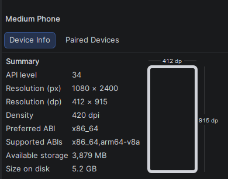

# 1-4

# Bài 1

- Vì dùng genymotion phải tải thêm virtualbox và nếu muốn code app để check các thứ khá bất tiện nên sẽ dùng hoàn toàn android studio và AVD để root

# Bài 2

- Thông tin emulator

- Vì app test đang khai báo `targetSdkVersion = 22` nhưng thiết bị emulator này sử dụng andoird 14 yêu cầu min version phải 23

- Tiến hành bypass `adb install --bypass-low-target-sdk-block InsecureBankv2.apk`
- Xem log thông qua `adb logcat`
- Push file vào emulator `adb push <path file host> <path file emulator>`

- Kéo file từ emulator về `adb pull <path file emulator> <path file host>`

# Bài 3

## MobSF

- Là công cụ kiểm thử tự động andoird/ios/win, phân tích mal, hỗ trợ cả về tĩnh và động. Kết quả từ MobSF dùng để đánh giá sơ bộ về độ bảo mật của một chương trình
- Cài đặt MobSF
    - clone `https://github.com/MobSF/Mobile-Security-Framework-MobSF`
    - Cài đặt python, openssl
    - Chạy `setup.bat`
    - Chạy `run.bat 127.0.0.1:8000`
    
    
    
- Upload apk lên để phân tích

- Kiểm tra phân quyền
    - `android.permission.ACCESS_COARSE_LOCATION` : MobSF đánh dấu là **dangerous**. Cho phép app lấy **vị trí gần đúng** dựa trên mạng di động/Wi-Fi
    - `android.permission.GET_ACCOUNTS` : Quyền này cho phép app lấy danh sách tài khoản trên thiết bị, ví dụ Google account hoặc các account được lưu trong Android Account Manager
    - `android.permission.INTERNET` : Quyền này cho phép app tạo kết nối mạng. Một app ngân hàng chắc chắn cần quyền này để kết nối server. Tuy nhiên khi kết hợp với các quyền khác như `READ_CONTACTS, GET_ACCOUNTS, ACCESS_COARSE_LOCATION,...` thì risk tăng lên vì get in4 xong gửi ra ngoài
    - `android.permission.READ_CONTACTS` : Quyền này cho phép đọc danh bạ người dùng, nếu app ko có chức năng này thì đây khá risk

- Kiểm tra manifest
    - App khá cũ nên mobsf alert
    - Mở debug `android:debuggable=true` ⇒ risk
    - Cho phép backup dữ liệu `android:allowBackup=true`  ⇒ vì cho phép backup qua adb ⇒ risk
    - `PostLogin`  không được bảo vệ `android:exported=true` tức là có thể được app khác trên cùng thiết bị gọi trực tiếp ⇒ bypass luồng, authen, …
    - StrandHogg 2.0 - Android quản lý giao diện app bằng các **Activity** và xếp chúng trong một **task/back stack**. StrandHogg 2.0 lợi dụng cơ chế này để app độc hại có thể chèn một màn hình giả vào luồng giao diện của app thật - trên PostLogin, DoTransfer, ViewStatement,…

- Show các activity trong app

- Show các string trong app

- APKID phát hiện app có check sử dụng máy thật hay emulator

## Kiểm tra thông tin đăng nhập trong cơ sở dữ liệu

- Đăng nhập với thông tin `dinesh/Dinesh@123$`  sau đó pull database về máy. Vì pull về cần quyền root nên copy database sang `tmp` rồi cấp lại quyền sau đó pull về
- Check không thấy db lưu thông tin gì nhạy cảm ⇒ safe

- Tìm kiếm các thông tin nhạy cảm lưu dưới plaintext `grep -r 'device' $(find)` như `deviceid, phone, uuid,...` không thấy ⇒ safe

## Backup file

- Vì MobSF alert app cho phép backup, thử backup và xem nội dung backup `adb backup -apk -shared com.android.insecurebankv2`
- Dùng `java -jar abe-540a57d.jar unpack backup.ab backup.tar` để extract file backup
- Thấy được thông tin server cũng như mã hóa username khá yếu bằng base64

## Thông tin đăng nhập lộ ở log

- Dùng `adb logcat` và đăng nhập thì thấy lộ thông tin

## Mã hóa yếu

- Key và IV được set cứng mặc dù thuật toán mã hóa mạnh

## Hijacking

- Vì như MobSF có alert thì activity có export là true nên dùng `am start -n com.android.insecurebankv2/.DoTransfer`  - `am` Activity Manager giúp **mở màn hình app, gửi intent (start), gọi broadcast, start service, force-stop app** từ terminal. App tự chuyển đến không cần đăng nhập

# Bài 4

## Cấu trúc file APK

- `META-INF` có trong các file apk đã sign và chứa các cert
- `lib` chứa native lib để app sử dụng (`.so`)
- `res` chứa tất cả XML
- `AndroidManifest.xml` tên, phiên bản, các quyền (permission), các thành phần (activity, service, provider,…) trong app
- `class.dex` mã nguồn của ứng dụng đã được biên dịch thành bytecode
- `resources.arsc`  tài nguyên đã được biên dịch thành bảng tra cứu, liên kết mã nguồn với các tài nguyên trong thư mục `res`

## Decompile + rev + patch

- Vì phần này trong github khá dài nên sẽ làm lại và chung 1 phần. Về cơ bản vẫn sẽ là decompile > rev > patch
- Để decompile file apk sử dụng `apktool d <name>.apk` và bytecode sẽ chuyển thành smali

- Rõ ràng device đã được rooted nhưng tại sao app lại bảo device chưa root? Mở jadx tiến hành rev.
- Ở activity PostLogin có đoạn check `Superuser.apk` và một hàm check process

- Hai hàm check này đều trả về false, đối với hàm đầu tiên vì app đang check sai path và check khá cũ đối với root mới, path đúng phải là `/system/bin/which`
- Tiến hành decompile (`apktool_3.0.2.jar d InsecureBankv2.apk`) và tìm đoạn smali tương ứng

- Sửa và patch
    - `apktool_3.0.2.jar b InsecureBankv2 -o InsecureBankv3.apk`
    - `keytool -genkeypair -v -keystore InsecureBankv3.keystore -alias InsecureBankv3 -keyalg RSA -keysize 2048 -validity 10000`
    - `apksigner sign --ks InsecureBankv3.keystore InsecureBankv3.apk`
- Hoan thanh

