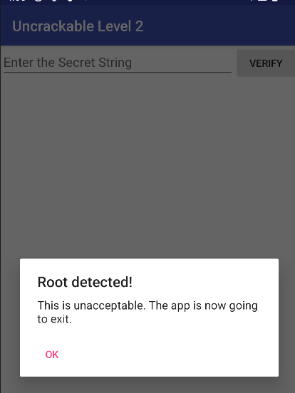

# Bài tập day2

# SSL pinning

- Tham khảo [tại đây](https://www.trellix.com/assets/docs/atr-library/ms-bypass-ssl-pinning-android-4-6_als10.pdf)
- Là kỹ thuật dùng để đảm bảo app chỉ tin tưởng **đúng certificate hoặc public key của server thật**, thay vì tin mọi chứng chỉ được hệ điều hành hoặc CA hệ thống chấp nhận. Android kiểm tra HTTPS bằng cách hỏi: “Certificate này có được CA tin cậy ký không?” Còn **SSL pinning** hỏi thêm: “Certificate/public key này có đúng cái app đã ghim sẵn không?”
- Hỗ trợ chống Man in the middle attack

## Cert pin

- Khi chương trình chạy bắt đầu giao tiếp với server thì server gửi về cert. Dùng cert này để so sánh với cert được pin ở app.
- Khi cert hết hạn hoặc server đổi cert, app chưa update ⇒ lose connection

## Pub key pin

- Lấy pub key từ cert và compare với key set sẵn.
- Linh hoạt hơn vì nếu server đổi cert nhưng vẫn dùng pub key cũ kí thì vẫn được.

## Hash pin

- Kiểu pin này thường cung cấp dưới dạng native api
- Dùng để chứng thực danh tính tổ chức in case bị fake

## Loại pin

- Tĩnh thì set cứng trên app
- Động thì không set cứng mà lấy cert/key từ lần giao tiếp đầu tiên lưu lại và dùng cho sau này.

## Triển khai

- Trong XML `Network Security Config` , trong `OkHttp CertificatePinner` ,…
- Để check một app có ssl pinning không sử dụng MobSF vào `file analysis` tìm có cert hard coded hay pinning hay không. Hoặc không intercept được request nào

## Bypass

- Tham khảo thêm [tại đây](https://mas.owasp.org/MASTG/techniques/android/MASTG-TECH-0012/)
- Khá nhiều cách bypass, phụ thuộc vào app triển khai như nào
    - Thêm custom CA.: Các app thường tin vào các pre-install system CA, nên nếu có cert trust hợp lệ thì add vào. (dùng burp làm proxy)
    - Overwrite (khi decomplie thấy cert, thì ghi đè cert đó), patch, hook,…

# Tool

- Sử dụng Xposed framework, ở đây hỗ trợ bypass root detection, emulator detection bypass, bypass ssl pinning
- Objection bypass ssl pinning, tham khảo thêm [tại đây](https://github.com/tsug0d/AndroidMobilePentest101/blob/master/vietnamese/AndroidMobilePentest101_Bai8_Vietnamese.pdf)

# Intent

- Đã có bài nói về intent

# Broadcast & receiver

- **Broadcast** là một kiểu “thông báo sự kiện” được gửi bằng `Intent`
- Broadcastreceiver là thành phần dùng để **nhận và xử lý** các broadcast đó. Tức để lắng nghe và trả lời các lời gọi hệ thống hoặc app khác
- Không có interface để tương tác
- Đăng ký một receiver  dùng `registerReceiver()` hoặc khai báo trong `AndroidManifest.xml`

```jsx
+++++++++++++++XML++++++++++++
<receiver
    android:name=".MyReceiver"
    android:exported="false">
    <intent-filter>
        <action android:name="android.intent.action.BOOT_COMPLETED" />
    </intent-filter>
</receiver>

+++++++++++++++CODE++++++++++++

val receiver = object : BroadcastReceiver() {
    override fun onReceive(context: Context, intent: Intent) {
        Log.d("Receiver", "Action: ${intent.action}")
    }
}

val filter = IntentFilter(Intent.ACTION_BATTERY_LOW)
registerReceiver(receiver, filter)
```

- Khi broadcast khớp với receiver, Android sẽ gọi `onReceive()`

# [Crackme android](https://github.com/OWASP/mastg/tree/master/Crackmes/Android)

## Level 2

- Tải và cài lên emulator. Sau khi chạy phát hiện root detect và có thể thấy thêm app này đang yêu cầu nhập string sau đó verify.  Khả năng app này chỉ cần xem chuỗi cần nhập là gì.



- Check qua app này có sử dụng native lib, khả năng khá cao mọi logic sẽ được nhét vào này


- Manifest có mỗi main và bên trong là khai báo intent


- Như dự đoán ban đầu toàn bộ code chính của app nằm ở native lib, layer java chỉ thực hiện cơ bản như check root (hard coded path), check debug (dựa vào thông tin [flag](https://developer.android.com/reference/android/content/pm/ApplicationInfo#FLAG_DEBUGGABLE)). Hàm native cần focus ở đây là `init`


- Bypass những đoạn này với frida khá dễ, nhưng hiện chưa để làm gì nên xem thử native lib có gì. Thấy được 2 hàm JNI
    - `Init` sử dùng tech chính ở đây là fork và ptrace
        
        
        
    - `bar` sử dụng để compare với `Thanks for all the fish` ⇒ done
        
        
        
- Bài này khá dễ, chưa luyện được gì nhiều nên chuyển thêm cách dùng frida hook xem xem hàm strncmp đang cmp cái gì ở đây


```jsx
function hookStrncmp() {
    let strncmpPtr = null;

    try {
        const libc = Process.getModuleByName("libc.so");
        strncmpPtr = libc.getExportByName("strncmp");
    } catch (e) {
        console.log("[-] Cannot find strncmp: " + e);
        return;
    }

    console.log("[+] strncmp found at: " + strncmpPtr);

    Interceptor.attach(strncmpPtr, {
        onEnter: function (args) {
            this.s1ptr = args[0];
            this.s2ptr = args[1];
            this.len = args[2].toInt32();

            let s1 = "";
            let s2 = "";

            try {
                s1 = this.s1ptr.readUtf8String(this.len);
            } catch (e) {
                s1 = "<cannot read s1>";
            }

            try {
                s2 = this.s2ptr.readUtf8String(this.len);
            } catch (e) {
                s2 = "<cannot read s2>";
            }

            if (this.len === 23) {
                console.log("\n[strncmp]");
                console.log("s1 = " + s1);
                console.log("s2 = " + s2);
            }
        },

        onLeave: function (retval) {
            if (this.len === 23) {
                console.log("ret = " + retval.toInt32());
            }
        }
    });
}

function bypassRootCheck() {
    Java.perform(function () {
        console.log("[*] Bypassing root check");

        const rootCheck = Java.use("sg.vantagepoint.a.b");

        rootCheck.a.implementation = function () {
            console.log("rootCheck.a()");
            return false;
        };

        rootCheck.b.implementation = function () {
            console.log("rootCheck.b()");
            return false;
        };

        rootCheck.c.implementation = function () {
            console.log("rootCheck.c()");
            return false;
        };
    });
}

hookStrncmp();
bypassRootCheck();

frida -U -f owasp.mstg.uncrackable2 -l level2.js
```

## Level 3

- Tượng tự level 2 ở đây vẫn check root
- Trong app này có check integrity của lib
    
    
    
    - `getResources().getString(owasp.mstg.uncrackable3.R.string.x86_64))` lấy value tại `/res/value/strings` , value này là giá trị checksum của lib được set sẵn
        
        
        
    - `zipfile` đại diện cho APK vì bản chất APK là zip các thành phần lại. Và `getPackageCodePath` trả về path của APK đang chạy
    - Sau khi lấy value checksum thì `crc` sẽ được lưu dưới dạng `key, value` . Ví dụ `x86_64, 2856060114`
    - Lặp qua các type lib `str` được gán thành path của native lib, tức `str` sẽ có dạng `lib/x86_64/libfoo.so`
    - Có được path `entry2` lấy native lib tại path đó (trong APK) và tính toán checksum. Nếu value khác với `entry` thì tức đã bị chỉnh sửa
    - Tương tự cho `classes.dex`
- Tiếp đến vẫn là check root dựa vào hard coded path như level2. Mọi thứ vẫn focus vào native lib và `pizzapizzapizzapizzapizz`  được truyền vào cho `init` ở native lib
    
    
    
- Hàm `bar` đang thực hiện check và xor với len là 24
    - `dest` là global var chưa khởi tạo, nhưng được set ở `init` với giá trị `pizzapizzapizzapizzapizz`
    - `v7` được set từ `sub_12C0`
    - `v4` là input
- Hàm `sub_12C0` khá dài nhưng chỉ cần focus vào đoạn này
    
    
    
    - Ở đây đang set giá trị `15131D5A1903000D1549170F1311081Dh` và `14130817005A0E08h`vào array `r14`
- Tất cả đều rõ chỉ việc xor ngược lại là xong

```jsx
from pwn import *
apkset = bytes.fromhex("70 69 7a 7a 61 70 69 7a 7a 61 70 69 7a 7a 61 70 69 7a 7a 61 70 69 7a 7a")
v7 = bytes.fromhex("1d 08 11 13 0f 17 49 15 0d 00 03 19 5a 1d 13 15 08 0e 5a 00 17 08 13 14")
print(xor(apkset, v7).decode())

# making owasp great again
```

- Dynamic ở level này có thể bypass root check, integrity check (patching, hooking)

## Level 4

- Thứ tự bài này sẽ hơi lộn xộn, nhưng tham khảo thêm tại
    - [ytb1](https://youtu.be/_8Z1_Yvt28o?si=dXQNCcDaTGLte3wV)
    - [ytb2](https://youtu.be/M0ETKs6DZn8?si=ayGPSqcJgvBc5yvI)
    - [blog1](https://redfenec.com/r2pay-under-the-microscope-runtime-protections/)
    - [blog2](https://www.romainthomas.fr/post/20-09-r2con-obfuscated-whitebox-part1/#fn:2)
- Level này khoan tập trung vào layer java/kotlin mà tập trung vào lib native và cách gọi function trong lib native
- JNI có 2 cách nối Java native method với hàm C/C++ trong `.so` tùy theo `so` dev loại nào
    - Khi `System.loadLibrary()` load `.so`, nếu library export `JNI_OnLoad` thì ART/Dalvik sẽ tự gọi hàm này, còn nếu không export thì sẽ dùng `dlsym`
    - Tham khảo [tại đây.](https://developer.android.com/ndk/guides/jni-tips#native-libraries)
    - Đặt tên hàm theo convention JNI
        - Ví dụ java có `public native byte[] gXftm3iswpkVgBNDUp(byte[] bArr, byte b);` thì native lib có thể export symbol kiểu `Java_re_pwnme_MainActivity_gXftm3iswpkVgBNDUp`
        - Lúc  này android dùng `dlsym` để tìm đúng symbol này trong `.so`
    - Đăng ký thủ công bằng `RegisterNatives()` trong `JNI_OnLoad()`
        - Tức khi `System.loadLibrary("native-lib")` thì android sẽ tự gọi `JNI_OnLoad(JavaVM* vm, void* reserved)` ()
        - Bên trong `JNI_OnLoad` dev tự custom RegisterNatives để khai báo mapping
            
            ```jsx
            JNIEXPORT jint JNI_OnLoad(JavaVM* vm, void* reserved) {
                JNIEnv* env;
                if (vm->GetEnv(reinterpret_cast<void**>(&env), JNI_VERSION_1_6) != JNI_OK) {
                    return JNI_ERR;
                }
            
                // Find your class. JNI_OnLoad is called from the correct class loader context for this to work.
                jclass c = env->FindClass("com/example/app/package/MyClass");
                if (c == nullptr) return JNI_ERR;
            
                // Register your class' native methods.
                static const JNINativeMethod methods[] = {
                    {"nativeFoo", "()V", reinterpret_cast<void*>(nativeFoo)},
                    {"nativeBar", "(Ljava/lang/String;I)Z", reinterpret_cast<void*>(nativeBar)},
                };
                int rc = env->RegisterNatives(c, methods, sizeof(methods)/sizeof(JNINativeMethod));
                if (rc != JNI_OK) return rc;
            
                return JNI_VERSION_1_6;
            }
            ```
            
        - `JNINativeMethod methods` tạo bảng mapping có dạng
            
            ```jsx
            typedef struct {
                const char* name;        // tên method sử dụng bên Java
                const char* signature;   // kiểu tham số + kiểu trả về
                void* fnPtr;             // địa chỉ function C/C++, function thực chất chạy với tên "name" ở layer java/kotlin
            } JNINativeMethod;
            ```
            
        - method dùng bên java tức là layer kotlin/java dùng name `public native void <name>(); như nào`
        - Địa chỉ function C tức function tương ứng mà name alias trỏ tới, tức function cần chạy
        - Ưu điểm của cách này là name function ở C đặt tên gì tùy thích, không cần export symbol rõ ràng. Ví dụ `{"check", "()Z", (void*)sub_xxx}` thì `sub_xxx` tuy không phải thực hiện chức năng check nhưng để name alias là `check` vẫn được.
- Có được struct và cách load native lib tìm hàm Onload và rev


- Function chính khá dài (chưa có cách rev được bằng static, dynamic dùng [qdbi](https://www.romainthomas.fr/post/20-09-r2con-obfuscated-whitebox-part1/#fn:2))
- Mặc dù đã hide root nhưng khi mở app vẫn bị terminated, xem `adb logcat` thấy được đoạn log vẫn còn check package name


- Hide name và mở thành công app


- Hook frida vào các hàm `open`

```jsx
function getExport(moduleName, symbolName) {
    const m = Process.getModuleByName(moduleName);
    const addr = m.findExportByName(symbolName);

    if (addr === null) {
        console.log("[-] Cannot find " + symbolName + " in " + moduleName);
        return null;
    }

    console.log("[+] " + symbolName + " @ " + addr);
    return addr;
}

function hook_C_open() {
    const open_address = getExport("libc.so", "open");
    if (open_address === null) return;

    Interceptor.attach(open_address, {
        onEnter: function(args) {
            try {
                const path = args[0];
                if (!path.isNull()) {
                    console.log("[+] opennnnnn: " + path.readCString());
                }
            } catch (e) {
                console.log("[-] open read error: " + e);
            }
        }
    });
}

hook_C_open();

[+] opennnnnn: /data/local/su
[+] opennnnnn: /data/local/bin/su
[+] opennnnnn: /data/local/xbin/su
[+] opennnnnn: /sbin/su
[+] opennnnnn: /su/bin/su
[+] opennnnnn: /system/bin/su

Process crashed: Bad access due to invalid address
 
***
*** *** *** *** *** *** *** *** *** *** *** *** *** *** *** ***
Build fingerprint: 'google/sdk_gphone64_x86_64/emu64xa:14/UE1A.230829.036.A4/12096271:user/release-keys'
Revision: '0'
ABI: 'x86_64'
Timestamp: 2026-05-25 02:18:03.966941400+0700
Process uptime: 2s
Cmdline: com.google.android.apps.turbo
pid: 15539, tid: 15566, name: re.pwnme  >>> com.google.android.apps.turbo <<<
uid: 10197
signal 11 (SIGSEGV), code 1 (SEGV_MAPERR), fault addr 0x00000000faba4975
    rax 000000008164a67b  rbx 00000000faba4975  rcx 00000000ac4ca725  rdx 00007e1d4dfeb601
    r8  00000000b7414965  r9  00007e1dbb134a00  r10 00007e1dbb1349f0  r11 00000000000035b2
    r12 8766843f6add1a00  r13 cc35d8a47681da00  r14 000000000000d6c8  r15 5a6369ec35bd0101
    rdi 00007e1d4dfeb618  rsi 00007e1d4dfeb744
    rbp 00007e1dbb137cb0  rsp 00007e1dbb1349f0  rip 00007e1d4de5c951
```

- Có thể thấy được app đang đọc file để check root. Tiến hành patch nhưng vẫn bị crash

```jsx
function hook_C_open_patch_su() {
    const open_address = getExport("libc.so", "open");
    if (open_address === null) return;

    Interceptor.attach(open_address, {
        onEnter: function(args) {
            try {
                const pathPtr = args[0];

                if (pathPtr.isNull()) return;

                const path = pathPtr.readCString();
                console.log("[+] opennnnnn: " + path);

                if (path.indexOf("su") !== -1) {
                    const fakePath = "/data/local/tmp/not_exist_file";

                    this.fakePath = Memory.allocUtf8String(fakePath);

                    args[0] = this.fakePath;

                    console.log("[+] patched open path:");
                    console.log("    old: " + path);
                    console.log("    new: " + fakePath);
                }
            } catch (e) {
                console.log("[-] open patch error: " + e);
            }
        }
    });
}

+] opennnnnn: /data/local/su
[+] patched open path:
    old: /data/local/su
    new: /data/local/tmp/not_exist_file
[+] opennnnnn: /data/local/bin/su
[+] patched open path:
    old: /data/local/bin/su
    new: /data/local/tmp/not_exist_file
[+] opennnnnn: /data/local/xbin/su
[+] patched open path:
    old: /data/local/xbin/su
    new: /data/local/tmp/not_exist_file
[+] opennnnnn: /sbin/su
[+] patched open path:
    old: /sbin/su
    new: /data/local/tmp/not_exist_file
[+] opennnnnn: /su/bin/su
[+] patched open path:
    old: /su/bin/su
    new: /data/local/tmp/not_exist_file
[+] opennnnnn: /system/bin/su
[+] patched open path:
    old: /system/bin/su
    new: /data/local/tmp/not_exist_file
Process crashed: Bad access due to invalid address

***
*** *** *** *** *** *** *** *** *** *** *** *** *** *** *** ***
Build fingerprint: 'google/sdk_gphone64_x86_64/emu64xa:14/UE1A.230829.036.A4/12096271:user/release-keys'
Revision: '0'
ABI: 'x86_64'
Timestamp: 2026-05-25 02:20:34.184193800+0700
Process uptime: 1s
Cmdline: com.google.android.apps.turbo
pid: 15639, tid: 15667, name: re.pwnme  >>> com.google.android.apps.turbo <<<
uid: 10197
signal 11 (SIGSEGV), code 1 (SEGV_MAPERR), fault addr 0x00000000faba4975
    rax 000000008164a67b  rbx 00000000faba4975  rcx 00000000ac4ca725  rdx 00007e1d4d3f8601
    r8  00000000b7414965  r9  00007e1dbb0eda00  r10 00007e1dbb0ed9f0  r11 00000000000035b2
    r12 8766843f6add1a00  r13 cc35d8a47681da00  r14 000000000000d6c8  r15 5a6369ec35bd0101
    rdi 00007e1d4d3f8618  rsi 00007e1d4d3f8744
    rbp 00007e1dbb0f0cb0  rsp 00007e1dbb0ed9f0  rip 00007e1d4d269951
```

- Hook vào `sprintf` và `opendir`

```jsx
// frida-ps -Uai | findstr /i pwnme
function getExport(moduleName, symbolName) {
    const m = Process.getModuleByName(moduleName);
    const addr = m.findExportByName(symbolName);

    if (addr === null) {
        console.log("[-] Cannot find " + symbolName + " in " + moduleName);
        return null;
    }

    console.log("[+] " + symbolName + " @ " + addr);
    return addr;
}

function hook_C_open_patch_su() {
    const open_address = getExport("libc.so", "open");
    if (open_address === null) return;

    Interceptor.attach(open_address, {
        onEnter: function(args) {
            try {
                const pathPtr = args[0];

                if (pathPtr.isNull()) return;

                const path = pathPtr.readCString();
                console.log("[+] opennnnnn: " + path);

                if (path.indexOf("su") !== -1) {
                    const fakePath = "/data/local/tmp/not_exist_file";

                    this.fakePath = Memory.allocUtf8String(fakePath);

                    args[0] = this.fakePath;

                    console.log("[+] patched open path:");
                    console.log("    old: " + path);
                    console.log("    new: " + fakePath);
                }
            } catch (e) {
                console.log("[-] open patch error: " + e);
            }
        }
    });
}

function hook_C_opendir() {
    const opendir_address = getExport("libc.so", "opendir");
    if (opendir_address === null) return;

    Interceptor.attach(opendir_address, {
        onEnter: function(args) {
            try {
                this.path = args[0].readCString();
                console.log("[+] opendirrrrr: " + this.path);
            } catch (e) {
                console.log("[-] opendir read error: " + e);
            }
        },

        onLeave: function(retval) {
            try {
                console.log("[+] opendir return: " + retval + " for " + this.path);
            } catch (e) {}
        }
    });
}

function hook_C_snprintf() {
    const snprintf_address = getExport("libc.so", "snprintf");
    if (snprintf_address === null) return;

    Interceptor.attach(snprintf_address, {
        onEnter: function(args) {
            this.buf = args[0];
        },
        onLeave: function(retval) {
            try {
                if (!this.buf.isNull()) {
                    console.log("[+] snprintffffffff: " + this.buf.readCString());
                }
            } catch (e) {
            }
        }
    });
}

hook_C_open_patch_su();
hook_C_opendir();
hook_C_snprintf();

[+] opendirrrrr: /proc/self/status
[+] opendir return: 0x7e1eac6fa010 for /proc/self/task
[+] snprintffffffff: /proc/self/task/16613/status
[+] snprintffffffff: /proc/self/task/16614/status
[+] snprintffffffff: /proc/self/task/16615/status
[+] snprintffffffff: /proc/self/task/16616/status
[+] snprintffffffff: /proc/self/task/16617/status
[+] snprintffffffff: /proc/self/task/16618/status
[+] snprintffffffff: /proc/self/task/16619/status
[+] snprintffffffff: /proc/self/task/16620/status
[+] snprintffffffff: /proc/self/task/16621/status
[+] snprintffffffff: /proc/self/task/16623/status
[+] snprintffffffff: /proc/self/task/16624/status
[+] snprintffffffff: /proc/self/task/16625/status
[+] snprintffffffff: /proc/self/task/16626/status
[+] snprintffffffff: /proc/self/task/16627/status
[+] snprintffffffff: /proc/self/task/16628/status
[+] snprintffffffff: /proc/self/task/16632/status
[+] snprintffffffff: /proc/self/task/16633/status
[+] opennnnnn: /data/local/su
[+] patched open path:
    old: /data/local/su
    new: /data/local/tmp/not_exist_file
[+] opennnnnn: /data/local/bin/su
[+] patched open path:
    old: /data/local/bin/su
    new: /data/local/tmp/not_exist_file
[+] opennnnnn: /data/local/xbin/su
[+] patched open path:
    old: /data/local/xbin/su
    new: /data/local/tmp/not_exist_file
[+] opennnnnn: /sbin/su
[+] patched open path:
    old: /sbin/su
    new: /data/local/tmp/not_exist_file
[+] opennnnnn: /su/bin/su
[+] patched open path:
    old: /su/bin/su
    new: /data/local/tmp/not_exist_file
[+] opennnnnn: /system/bin/su
[+] patched open path:
    old: /system/bin/su
    new: /data/local/tmp/not_exist_file
```

- Thấy được chương trình đang mở `task` và copy rất nhiều path vào buffer. Mở xem các status này có gì
- Khi chạy thêm option `frida -U -f re.pwnme -l level4.js --pause` .  Sau đó chuyển app về chế độ nền, tức cho màn hình điện thoại ra home. Tiếp đến chạy `%resume`
    - Vì app này rất dễ crash nên việc check khá khó. Dùng pause để frida chỉ spawn process và inject agent, dừng main thread lại sớm. Sau đó không để Activity/app tiếp tục foreground như bình thường nên giữ process sống trong background, tức process vẫn chạy chỉ có mainactivity không chạy/chưa chạy xong nên chưa bị crash do đó có thêm thời gian check
- Dùng `ps -A | grep "re.pwnme"` check PID
- `cd /proc/<pid>/task` → `cat ./*/status` thì thấy dấu hiệu của frida
    - Bênh trong thư mục task chứa tất cả thread của 1 process
    - Đọc status của tất cả thread
    
    
    
- Patch snprintf

```
function hook_C_snprintf() {
    const snprintf_address = getExport("libc.so", "snprintf");
    if (snprintf_address === null) return;

    Interceptor.attach(snprintf_address, {
        onEnter: function(args) {
            this.buf = args[0];             
            this.size = args[1].toInt32();  
        },

        onLeave: function(retval) {
            try {
                if (this.buf.isNull()) return;

                const path = this.buf.readCString();
                console.log("[+] snprintf: " + path);

                if (path.indexOf("status") !== -1) {
                    const fakePath = "/proc/self/status";

                    if (fakePath.length + 1 <= this.size) {
                        this.buf.writeUtf8String(fakePath);

                        console.log("[+] patched snprintf output:");
                        console.log("    old: " + path);
                        console.log("    new: " + this.buf.readCString());
                    } else {
                        console.log("[-] fakePath too long for snprintf buffer");
                    }
                }
            } catch (e) {
                console.log("[-] snprintf patch error: " + e);
            }
        }
    });
}
```

- Lần này có một lỗi khác `Process crashed: java.lang.ArithmeticException: divide by zero` nằm ở  layer java.
- Check java thấy được đang chia một số với 0


- Patch luôn hàm này
- Sau khi patch hết `fd, status, root` vẫn vứt ra lỗi. Tìm địa chỉ lỗi (offset: 000000000011c58e)trong lib


- Trace thấy được đoạn code tại offset này nằm trong hàm `start_routine` và hàm này được  gọi từ `_pthread_create` - tức sẽ chạy song song 2 luồng. Tức là những thứ đã bypass lúc đầu có khả năng sẽ chạy tiếp một luồng riêng và check liên tục


- Bonus: Đa luồng được tạo ra chính bởi 2 hàm `sub_AE00, sub_12CAD0`


- Tại đây `sub_174510, sub_2EB00(start_routine )` được tạo để chạy song song


- Ý tưởng sẽ patch không cho tạo thread
- Hàm này được gọi từ một lib khác và nằm tại plt


- Quá trình native lib được call

```jsx
App gọi System.loadLibrary / dlopen
        ↓
linker64 nhận request load .so
        ↓
do_dlopen xử lý load library
        ↓
tìm path thật của libnative-lib.so
        ↓
mmap các segment ELF vào memory
        ↓
resolve dependency: libc.so, liblog.so, ...
        ↓
relocation: sửa GOT/PLT, symbol address
        ↓
gọi constructor: .init_array / init function
        ↓
sau đó JNI_OnLoad hoặc native init có thể chạy
```

- Hook tìm base của `libnative` vì hàm tạo thread được lấy và tính toán từ lib khác và lưu offset tại các tool, nên cần phải có base của lib gốc
    - Phải hook lần lượt vào `do_dlopen` và `call_constructor` , nếu hook riêng
        - `do_dlopen` ở
            - `onEnter` thì lúc này chưa có base và lib chưa load xong
            - `onLeave` lúc này lib đã load xong và đã chạy constructor (init) nên sẽ bị pass
        - `call_constructor` thì constructor này cho nhiều lib mà app dùng nên bị rối

```jsx
var libnative_loaded = 0;
var do_dlopen = null;
var call_ctor = null;

Process.findModuleByName('linker64').enumerateSymbols().forEach(function (sym) {
    if (sym.name.indexOf('do_dlopen') >= 0) {
        do_dlopen = sym.address;
    } else if (sym.name.indexOf('call_constructor') >= 0) {
        call_ctor = sym.address;
    }
});

Interceptor.attach(do_dlopen, function () {
    var libraryPath = this.context.rdi.readCString();

    if (libraryPath.indexOf('libnative-lib.so') > -1) {
        console.log("target libnative loading....");

        Interceptor.attach(call_ctor, function () {
            if (libnative_loaded == 0) {
                var native_mod = Process.findModuleByName('libnative-lib.so');

                console.log("[+] libnative loaded @" + native_mod.base);
                // patchPthreadCreate_x64_writer(native_mod.base);
            }

            libnative_loaded = 1;
        });
    }
});

```

- Tìm được base tiến hành patch

```jsx
function patchPthreadCreate_x64_writer(base_addr) {
    const pthread_plt = base_addr.add(0x60C0);

    Memory.patchCode(pthread_plt, 16, function (code) {
        const cw = new X86Writer(code, { pc: pthread_plt });

        cw.putXorRegReg("eax", "eax");
        cw.putRet();

        cw.putNop();               
        cw.putNop();                   
        cw.putNop();

        cw.flush();
    });

    console.log("[+] patched pthread_create@plt:", Instruction.parse(pthread_plt));
    console.log("[+] patched pthread_create@plt 2:", Instruction.parse(pthread_plt.add(2)));
    console.log("[+] patched pthread_create@plt 3:", Instruction.parse(pthread_plt.add(3)));
}
[+] libnative loaded @0x75d8fbc85000
[+] patched pthread_create@plt: xor eax, eax
[+] patched pthread_create@plt 2: ret
[+] patched pthread_create@plt 3: nop
```

- Full script

```jsx
// frida -U -f re.pwnme -l lv4.js
var libnative_loaded = 0;
var do_dlopen = null;
var call_ctor = null;

hook_C_snprintf();

Process.findModuleByName('linker64').enumerateSymbols().forEach(function (sym) {
    if (sym.name.indexOf('do_dlopen') >= 0) {
        do_dlopen = sym.address;
    } else if (sym.name.indexOf('call_constructor') >= 0) {
        call_ctor = sym.address;
    }
});

Interceptor.attach(do_dlopen, function () {
    var libraryPath = this.context.rdi.readCString();

    if (libraryPath.indexOf('libnative-lib.so') > -1) {
        console.log("target libnative loading....");

        Interceptor.attach(call_ctor, function () {
            if (libnative_loaded == 0) {
                var native_mod = Process.findModuleByName('libnative-lib.so');

                console.log("[+] libnative loaded @" + native_mod.base);

                //hook_syscall(native_mod.base);

                patchPthreadCreate_x64_writer(native_mod.base);
            }

            libnative_loaded = 1;
        });
    }
});

function patchPthreadCreate_x64_writer(base_addr) {
    const pthread_plt = base_addr.add(0x60C0);

    Memory.patchCode(pthread_plt, 16, function (code) {
        const cw = new X86Writer(code, { pc: pthread_plt });

        cw.putXorRegReg("eax", "eax");
        cw.putRet();

        cw.putNop();               
        cw.putNop();                   
        cw.putNop();

        cw.flush();
    });

    console.log("[+] patched pthread_create@plt:", Instruction.parse(pthread_plt));
    console.log("[+] patched pthread_create@plt 2:", Instruction.parse(pthread_plt.add(2)));
    console.log("[+] patched pthread_create@plt 3:", Instruction.parse(pthread_plt.add(3)));
}

var _syscall = [
    {
    "offset": 0x0263674,
    "name": "syscall"
},
{
    "offset": 0x02636A4,
    "name": "syscall"
},
{
    "offset": 0x02636C4,
    "name": "syscall"
}
]

function hook_syscall(base_addr) {
    _syscall.forEach(function (item) {
        const syscall_addr = base_addr.add(item.offset);
        Interceptor.attach(syscall_addr, {
            onEnter: function (args) {
                console.log("[+] syscall called => " + item.offset + " name: "  + this.context.rax.toInt32());;
            }
        });
    }
);
}

function getExport(moduleName, symbolName) {
    const m = Process.getModuleByName(moduleName);
    const addr = m.findExportByName(symbolName);

    if (addr === null) {
        console.log("[-] Cannot find " + symbolName + " in " + moduleName);
        return null;
    }

    console.log("[+] " + symbolName + " @ " + addr);
    return addr;
}

function hook_C_snprintf() {
    const snprintf_address = getExport("libc.so", "snprintf");
    var buf = null;

    Interceptor.attach(snprintf_address, {
        onEnter: function (args) {
            buf = args[0];
        },

        onLeave: function (retval) {

                if (buf.readCString().indexOf("status") !== -1) {
                    const fakePath = "/data/local/tmp/fake_status";
                    
                    buf.writeUtf8String(fakePath);
                }

                console.log("[+] snprintf => " + buf.readCString());

        }
    });
}
```

- Bonus:
    - Việc hook syscall không cần thiết, nếu hook sẽ gây crash bởi vì có cơ chế integrity check, tham khảo thêm ở video ytb.
    - Không cần hook vào `fd` vì khi chạy app không thấy có lib liên quan đến frida. Nếu check và thấy lib liên quan đến frida thì mới cần hook và patch.