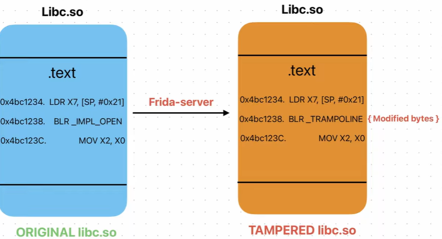

# Lý thuyết day2

# Detect frida by checking integrity

## Disk vs mem

- Tham khảo tại [youtube](https://youtu.be/8FZYmsDUj-c?si=c3b0Z00vAvC81XQP), [ytb2](https://youtu.be/yipcDMRHBG4?si=b5d0Q9ohZeXSoTn0)
- Mục tiêu hiểu được integrity của app khi chạy bình thường có khác gì so với integrity của app khi bị inject frida.
- Khi frida hook vào một function/method thì frida sẽ inject trampoline vào đầu function/method đó. Có thể hình dung được như hình
    
    
    
- Kiểm chứng thông qua thực nghiệm. Ý tưởng của việc thực nghiệm này sẽ có một hàm `sensitive_check` và các button thực hiện chức năng đọc 32 byte đầu của hàm này và in ra. Và script frida hook vào sẽ dump ra byte đầu của hàm trước và sau khi hook

```jsx
const libName = "libintegritydemo.so";
const symbolName = "sensitive_check";

function dumpBytes(addr, title) {
    console.log("\n[" + title + "]");
    console.log(hexdump(addr, {
        offset: 0,
        length: 32,
        header: false,
        ansi: false // ma mau
    }));
}

function listIntegrityModules() {
    console.log("[*] Loaded modules containing 'integrity':");

    const modules = Process.enumerateModules();

    for (let i = 0; i < modules.length; i++) {
        const m = modules[i];

        if (m.name.toLowerCase().includes("integrity")) {
            console.log("    " + m.name + " @ " + m.base + " size=" + m.size);
        }
    }
}

function findTarget() {
    const module = Process.findModuleByName(libName);

    if (module === null) {
        console.log("[-] Cannot find module: " + libName);
        listIntegrityModules();
        return null;
    }

    console.log("[+] Found module: " + module.name + " @ " + module.base);

    let target = module.findExportByName(symbolName);

    if (target !== null) {
        console.log("[+] Found export: " + symbolName + " @ " + target);
        return target;
    }

    console.log("[-] Cannot find export: " + symbolName);
    console.log("[*] Trying enumerateSymbols fallback...");

    const symbols = module.enumerateSymbols();

    for (let i = 0; i < symbols.length; i++) {
        const s = symbols[i];

        if (s.name === symbolName || s.name.includes(symbolName)) {
            console.log("[+] Found symbol: " + s.name + " @ " + s.address);
            return s.address;
        }
    }

    console.log("[-] Cannot find symbol either: " + symbolName);
    return null;
}

setTimeout(function () {
    const target = findTarget();

    if (target === null) {
        console.log("[-] Hook failed because target was not found.");
        return;
    }

    dumpBytes(target, "Before Frida hook");

    Interceptor.attach(target, {
        onEnter(args) {
            console.log("[+] sensitive_check() called");
            console.log("    x = " + args[0].toInt32());
        },
        onLeave(retval) {
            console.log("[+] Original return = " + retval.toInt32());
            retval.replace(9999);
            console.log("[+] Replaced return = 9999");
        }
    });

    dumpBytes(target, "After Frida hook");

    console.log("[+] Hook installed.");
    console.log("[*] Now go back to the app and press:");
    console.log("    1. Call sensitive_check()");
    console.log("    2. Check Current Bytes");
}, 1000);
```

- Ý tưởng script trên là dump ra 32 byte đầu của hàm trước và sau khi hook
- Demo video
- Mấu chốt là app khi chạy một chức năng nào đó với **chế độ bình thường sẽ có những byte khác với lúc chạy với frida** do đó có thể sử dụng cách này để check integrity.
- Nếu check chuẩn hơn thì chương trình sẽ tìm và đọc lib trên disk path tại `/proc/self/maps` vì `7e1d9f20c000-7e1d9f26d000 r-xp 00c00000 fe:28 82982                      /data/app/~~IJyIg0TdewOpEJgiEn0KWg==/com.example.testapp-9B066fv3s5KgpKSAbB4TWA==/base.apk` là nội dung của `maps` từ đây có thể tính/đọc lib trên disk từ path này. Còn lại đọc trên mem thì đọc từ địa chỉ được list ra (chỉ chọn r-xp) ở đây luôn.
- Quay lại với apk được tham khảo ở video. Ở đây sẽ có một lib thực hiện việc check CRC32 của `libc` trên disk (tức lúc bình thường) và `libc` lúc bị hook. ⇒ Ý tưởng chính của check này đó là check hash libc ở disk so với libc ở mem
- Khi một app muốn check xem lib có bị can thiệp hay không thì app trước hết phải truy cập được vào thư viện đó, vì lib được lưu ở hệ thống nên app cũng cần quyền truy cập hệ thống
- Rev sơ qua thì lib này thực hiện việc check crc32 ở cả 2 nơi mem và disk bằng cách mở `/proc/self/maps` tìm mapping của lib, lấy các metadata. Sau đó mở file lib trên disk dùng `mmap` đọc và tính crc. Còn crc phía dưới dùng tính lib ở mem
    
    
    
- Bonus bypass: bypass sẽ dump lib ở mem và hook vào cho app đọc lib vừa dump

## Check itegrity qua `/proc/self/maps`

- Khi chạy hook thì trong maps sẽ có những lib khá sus so với khi chạy bình thường


## Play Integrity Checker

- Github [link](https://github.com/herzhenr/spic-android)
- [ ]  Tìm hiểu thêm

# Detect frida by stacktrace

- Bản chất là để check được có hook hay không dựa vào call stack. Tức function A chỉ được gọi bởi chain B-C-D-A nhưng bây giờ A được hook và gọi liền hoặc gọi không đúng chain  ⇒ detect. (không demo vì xử lý ở layer kotlin thiên về logic và kỹ thuật code)
- ART là môi trường runtime dùng để chạy app Android. Tức khi code app thì mã được compile thành `.dex` và ART chịu trách nhiệm load và chạy android. Ví dụ app có function

```jsx
fun checkLogin(): Boolean {
    return true
}
```

- Hàm này được ART quản lý dưới dạng internal method structure. Khi Frida hook, nó có thể can thiệp vào cách ART dispatch/gọi method đó.
- Luồng ART, nếu có hook thì sus lib có thể được chèn vào (2) hoặc (3)

```jsx
Kotlin MainActivity
    ↓ (1)
ART runtime
    ↓ (2)
JNI bridge
    ↓ (3)
libintegritydemo.so
    ↓
nativeValidateStack()
```

- Stack frame chỉ được lưu khi một quy ước call function được thực hiện đúng quy trình (có call, return address, set up stack của function được gọi,…). Nếu như quy trình này bị chỉnh sửa thì không được lưu lại chính xác. Khái niệm này giống với việc khi một hàm A call B tiếp B call C nhưng trong hàm B tới đoạn call C thay vì `call` thì lại dùng `jmp, jne, ...` tới C, lúc này khi thực hiện xong C thì ở ins `ret` trong C sẽ không có return address để return vì lúc này stack trong hàm C chưa khởi tạo và dọn dẹp cứ thế push value lên. Do đó không trả về được.
- Trong demo này sử dụng `unwindCallback`  cũng tương tự. Chỉ trace được khi call “chuẩn”, nếu bị patch byte thì sẽ không trace theo được
- Stack native trước và sau khi hook


```jsx
const libName = "libintegritydemo.so";
const jniSymbol = "Java_com_example_testapp_MainActivity_nativeShowStack";

function printFridaSideBacktrace(context) {
    console.log("[+] Frida-side native backtrace:");

    const bt = Thread.backtrace(context, Backtracer.ACCURATE)
        .map(DebugSymbol.fromAddress)
        .join("\n");

    console.log(bt);
}

setTimeout(function () {
    const m = Process.getModuleByName(libName);

    console.log("[+] module name = " + m.name);
    console.log("[+] module base = " + m.base);
    console.log("[+] module size = " + m.size);
    console.log("[+] module path = " + m.path);

    const target = m.findExportByName(jniSymbol);

    if (target === null) {
        console.log("[-] Cannot find JNI symbol: " + jniSymbol);
        console.log("[*] Enumerating symbols containing nativeShowStack:");

        const symbols = m.enumerateSymbols();

        for (const s of symbols) {
            if (s.name.includes("nativeShowStack")) {
                console.log("    " + s.name + " @ " + s.address);
            }
        }

        return;
    }

    console.log("[+] Found nativeShowStack JNI at " + target);

    Interceptor.attach(target, {
        onEnter(args) {
            console.log("[+] nativeShowStack() entered through Frida hook");
            printFridaSideBacktrace(this.context);
        },
        onLeave(retval) {
            console.log("[+] nativeShowStack() returned");
        }
    });

    console.log("[+] Native hook installed");
}, 1000);

[Android Emulator 5554::PID::4622 ]-> [+] module name = libintegritydemo.so
[+] module base = 0x7e1dbb88b000
[+] module size = 958464
[+] module path = /data/app/~~ylDf5oB08gbz6sJEcsLumw==/com.example.testapp-DcZhUQAlaq6joKLHvrbPFw==/base.apk!/lib/x86_64/libintegritydemo.so
[+] Found nativeShowStack JNI at 0x7e1dbb8eef30
[+] Native hook installed
[+] nativeShowStack() entered through Frida hook
[+] Frida-side native backtrace:
0x7e1db7191a4c libart.so!art_quick_generic_jni_trampoline+0xdc
0x7e1db7366018 libart.so!_ZN3art11interpreterL7ExecuteEPNS_6ThreadERKNS_20CodeItemDataAccessorERNS_11ShadowFrameENS_6JValueEbb.__uniq.112435418011751916792819755956732575238+0x288
0x7e206584cda0
[+] nativeShowStack() returned
```

- Khi bình thường, nativeShowStack được gọi từ Kotlin/Java thông qua ART/JNI, nên `_Unwind_Backtrace` có thể thu được các frame thuộc `libintegritydemo.so/base.apk` và `libart.so`. Điều này thể hiện đường gọi hợp lệ từ managed layer xuống native layer.
- Khi Frida hook nativeShowStack, Frida patch entry point của hàm bằng một jmp sang trampoline. Trampoline *(là một đoạn code trung gian mà Frida tự tạo ra để “đón” luồng thực thi trước khi chuyển sang hook function, nó có thể là các ins gốc bị ghi đè, xử lý call về hàm ban đầu,….)* này không tuân theo mô hình stack frame/unwind metadata chuẩn như một lời gọi hàm C/C++ thông thường. Vì vậy khi nativeShowStack gọi _Unwind_Backtrace, quá trình unwind bị truncate hoặc không lần ngược được tới các frame ART/JNI như baseline.
- Ngoài việc sử dụng function sẵn trong C, còn các kỹ thuật khác như FP walk - Tức trace bằng code thủ công, trong một số kiến trúc sẽ có FP và LR (return addr), thì khi ở hàm C thì các register này sẽ lưu value của previous function như FP hay LR, từ đó có thể trace trực tiếp theo frame thật trong memory, ít phụ thuộc hơn vào unwind metadata hoặc API backtrace có sẵn, tức sẽ đọc trong  stack frame thật trong memory

# Dex encrypt & dynamic loading

- DEX là bytecode (raw byte) của một ứng dụng. Tức là từ code kotlin/JAVA được complier compile tức lúc này chuyển sang byte và khi chạy thì ART có thể chạy bytecode này.
- **Dynamic class loading** là kỹ thuật nạp class từ file `.dex`, `.jar`, hoặc `.apk` có chứa `classes.dex` , thường sử dụng [`DexClassLoader`](https://developer.android.com/reference/dalvik/system/DexClassLoader)
- **Encrypt DEX/JAR** là việc mã hóa file chứa `classes.dex` Khi app chạy, nó giải mã ra file tạm trong private directory rồi mới load
- Demo code github
- Chọn assets vì enc là một file nhị phân tùy ý, không phải ảnh, layout, string hay resource Android thông thường. Tại đây phù hợp khi cần truy cập file gốc theo tên hoặc theo cấu trúc thư mục.
- Có thể dùng res/raw nhưng dùng thì chỉ khi cần đọc một file raw đơn giản bằng resource ID. Còn `assets` linh hoạt hơn nếu muốn giữ **tên file gốc**, **đuôi file tùy ý**, hoặc **cấu trúc thư mục**
- Vẫn nên hạn chế sử dụng vì tính intergrity và có thể bị thay thế file được load.