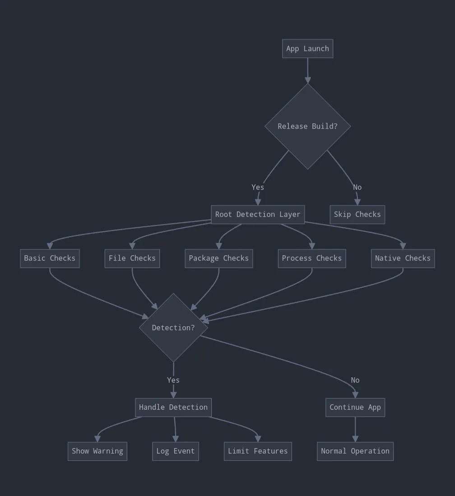

# **Frida**

- Là một bộ công cụ **dynamic instrumentation**: cho phép quan sát, hook, sửa hành vi của chương trình **khi chương trình đang chạy**, thay vì chỉ phân tích file tĩnh bằng IDA/Ghidra. Frida hỗ trợ nhiều hệ điều hành như Windows, macOS, Linux, Android, iOS, FreeBSD và QNX
- Dynamic analysis với Frida: chèn script vào process đang chạy để quan sát hoặc thay đổi hành vi runtime.
- Quy trình tổng quát

```cpp
Host machine
    |
    | adb + frida-tools
    v
Android device/emulator
    |
    | frida-server
    v
Target app

```

- Host chính là máy cá nhân dùng để phân tích , trên đó bao gồm `frida-tools, script.js, static tool`
- `adb` là cầu nối giữa máy host và Android device/emulator. Giúp check thiết bị, push file vào emulator, chạy shell, …
- Emulator là android studio, genymotion, … và thiết bị cần phải được [rooted](https://gitlab.com/newbit/rootAVD), thì khi đó mới có quyền attach, thao tác với app, …
- frida server chạy trên android giúp nhận lệnh từ frida tool, attach, inject frida, gửi log,…
- Target app là app phân tích

# Root detection

## Tổng quan

- là cơ chế app kiểm tra xem thiết bị có bị root, unlock bootloader, custom ROM, Magisk/Zygisk, hoặc môi trường bị can thiệp hay không
- Thường cơ chế check root không đứng một mình mà được cài ở nhiều nơi trong app và đi kèm với cơ chế anti-tampering khác.

## Một số dấu hiệu root mà app thường check.

- Tham khảo tại [link1](https://medium.com/@ahmedafatah/android-security-for-dummies-root-detection-695bd4d90db8), [link2](https://docs.talsec.app/appsec-articles/articles/simple-root-detection-implementation-and-verification)



```cpp
[RootDetection.kt]

class RootDetection(private val context: Context) {

    companion object {
        private const val TAG = "RootCheck"
    }
    
        private val ROOT_PACKAGES = setOf(
            "eu.chainfire.supersu",
            "com.noshufou.android.su",
            "com.koushikdutta.superuser",
            "com.zachspong.temprootremovejb",
            "com.ramdroid.appquarantine",
            "com.topjohnwu.magisk"
        )
    }

    fun mastgTest(): String {
        return when {
            checkRootFiles() || checkSuperUserApk() || checkSuCommand() || checkDangerousProperties() -> {
                "Device is rooted"
            }
            else -> {
                "Device is not rooted"
            }
        }
    }

    private fun checkRootFiles(): Boolean {
        val rootPaths = setOf(
            "/system/app/Superuser.apk",
            "/system/xbin/su",
            "/system/bin/su",
            "/sbin/su",
            "/system/sd/xbin/su",
            "/system/bin/.ext/.su",
            "/system/usr/we-need-root/su-backup",
            "/system/xbin/mu"
        )
        rootPaths.forEach { path ->
            if (File(path).exists()) {
                Log.d(TAG, "Found root file: $path")
            }
        }
        return rootPaths.any { path -> File(path).exists() }
    }

    private fun checkSuperUserApk(): Boolean {
        val superUserApk = File("/system/app/Superuser.apk")
        val exists = superUserApk.exists()
        if (exists) {
            Log.d(TAG, "Found Superuser.apk")
        }
        return exists
    }
    
    
    private fun checkRootPackages(): Boolean {
        val packageManager = context.packageManager
        return ROOT_PACKAGES.any { packageName ->
            try {
                packageManager.getPackageInfo(packageName, 0)
                Log.d(TAG, "Found root package: $packageName")
                true
            } catch (e: PackageManager.NameNotFoundException) {
                false
            }
        }
    }

    private fun checkSuCommand(): Boolean {
        return try {
            val process = Runtime.getRuntime().exec(arrayOf("which", "su"))
            val reader = BufferedReader(InputStreamReader(process.inputStream))
            val result = reader.readLine()
            if (result != null) {
                Log.d(TAG, "su command found at: $result")
                true
            } else {
                Log.d(TAG, "su command not found")
                false
            }
        } catch (e: IOException) {
            Log.e(TAG, "Error checking su command: ${e.message}", e)
            false
        }
    }

    private fun checkDangerousProperties(): Boolean {
        val dangerousProps = arrayOf("ro.debuggable", "ro.secure", "ro.build.tags")
        dangerousProps.forEach { prop ->
            val value = getSystemProperty(prop)
            if (value != null) {
                Log.d(TAG, "Dangerous property $prop: $value")
                if (value.contains("debug")) {
                    return true
                }
            }
        }
        return false
    }

    private fun getSystemProperty(prop: String): String? {
        return try {
            val process = Runtime.getRuntime().exec(arrayOf("getprop", prop))
            val reader = BufferedReader(InputStreamReader(process.inputStream))
            reader.readLine()
        } catch (e: IOException) {
            Log.e(TAG, "Error checking system property $prop: ${e.message}", e)
            null
        }
    }
}

```

## Native check

- **JNI (Java Native Interface)** **là một framework lập trình đóng vai trò là "cầu nối" trong ứng dụng Android**. Nó cho phép mã Java/Kotlin đang chạy trên Máy ảo Android (JVM/ART) giao tiếp trực tiếp với mã gốc (Native code) được viết bằng C hoặc C++
- Trong app android thường có 2 tầng

```cpp
Java/Kotlin layer
    |
    | gọi JNI
    v
Native C/C++ layer
```

- Native check thường check bằng `stat, access` thông qua JNI

```cpp
package com.example.security

import android.content.Context
import android.util.Log
import java.io.BufferedReader
import java.io.File
import java.io.IOException
import java.io.InputStreamReader

class RootDetection(private val context: Context) {

    companion object {
        private const val TAG = "RootCheck"

        init {
            try {
                System.loadLibrary("rootcheck")
            } catch (e: UnsatisfiedLinkError) {
                Log.e(TAG, "Failed to load native library: ${e.message}", e)
            }
        }
    }

    private external fun nativeRootCheck(): Boolean

    fun mastgTest(): String {
        val javaDetected =
            checkRootFiles() ||
            checkSuperUserApk() ||
            checkSuCommand() ||
            checkDangerousProperties()

        val nativeDetected = checkNativeRoot()

        return when {
            javaDetected || nativeDetected -> "Device is rooted"
            else -> "Device is not rooted"
        }
    }

    private fun checkNativeRoot(): Boolean {
        return try {
            val result = nativeRootCheck()
            Log.d(TAG, "Native root check result: $result")
            result
        } catch (e: UnsatisfiedLinkError) {
            Log.e(TAG, "Native root check is unavailable: ${e.message}", e)
            false
        } catch (e: Exception) {
            Log.e(TAG, "Native root check error: ${e.message}", e)
            false
        }
    }
```

```cpp
#include <jni.h>
#include <android/log.h>
#include <unistd.h>
#include <sys/stat.h>
#include <sys/system_properties.h>
#include <cstdio>
#include <cstring>
#include <string>
#include <vector>

#define LOG_TAG "RootCheckNative"
#define LOGD(...) __android_log_print(ANDROID_LOG_DEBUG, LOG_TAG, __VA_ARGS__)

static bool fileExistsNative(const char* path) {
    struct stat st{};
    if (stat(path, &st) == 0) {
        LOGD("Found suspicious path by stat(): %s", path);
        return true;
    }

    if (access(path, F_OK) == 0) {
        LOGD("Found suspicious path by access(): %s", path);
        return true;
    }

    return false;
}

static bool checkRootPathsNative() {
    const char* paths[] = {
        "/system/app/Superuser.apk",
        "/system/xbin/su",
        "/system/bin/su",
        "/sbin/su",
        "/system/sd/xbin/su",
        "/system/bin/.ext/.su",
        "/system/usr/we-need-root/su-backup",
        "/system/xbin/mu",
        "/system/bin/magisk",
        "/sbin/magisk",
        "/debug_ramdisk/magisk",
        "/data/adb/magisk",
        "/cache/magisk.log"
    };

    for (const char* path : paths) {
        if (fileExistsNative(path)) {
            return true;
        }
    }

    return false;
}

static bool getSystemPropertyNative(const char* key, std::string& outValue) {
    char value[PROP_VALUE_MAX] = {0};

    int len = __system_property_get(key, value);
    if (len > 0) {
        outValue = std::string(value);
        LOGD("System property %s=%s", key, value);
        return true;
    }

    return false;
}

static bool checkDangerousPropertiesNative() {
    std::string value;

    if (getSystemPropertyNative("ro.debuggable", value)) {
        if (value == "1") {
            LOGD("Dangerous property detected: ro.debuggable=1");
            return true;
        }
    }

    if (getSystemPropertyNative("ro.secure", value)) {
        if (value == "0") {
            LOGD("Dangerous property detected: ro.secure=0");
            return true;
        }
    }

    if (getSystemPropertyNative("ro.build.tags", value)) {
        if (value.find("test-keys") != std::string::npos) {
            LOGD("Dangerous property detected: ro.build.tags contains test-keys");
            return true;
        }
    }

    return false;
}

static bool checkWritableSystemMountNative() {
    FILE* fp = fopen("/proc/self/mounts", "r");
    if (fp == nullptr) {
        return false;
    }

    char line[1024];

    while (fgets(line, sizeof(line), fp) != nullptr) {
        std::string mountLine(line);

        bool isSystemMount =
            mountLine.find(" /system ") != std::string::npos ||
            mountLine.find(" /vendor ") != std::string::npos ||
            mountLine.find(" /product ") != std::string::npos;

        bool isWritable =
            mountLine.find(" rw,") != std::string::npos ||
            mountLine.find(" rw ") != std::string::npos;

        if (isSystemMount && isWritable) {
            LOGD("Writable system-related mount detected: %s", line);
            fclose(fp);
            return true;
        }
    }

    fclose(fp);
    return false;
}

static bool checkSelinuxPermissiveNative() {
    FILE* fp = fopen("/sys/fs/selinux/enforce", "r");
    if (fp == nullptr) {
        return false;
    }

    char value = '\0';
    size_t readCount = fread(&value, 1, 1, fp);
    fclose(fp);

    if (readCount == 1 && value == '0') {
        LOGD("SELinux appears to be permissive");
        return true;
    }

    return false;
}

extern "C"
JNIEXPORT jboolean JNICALL
Java_com_example_security_RootDetection_nativeRootCheck(
        JNIEnv* env,
        jobject thiz
) {
    bool rooted =
            checkRootPathsNative() ||
            checkDangerousPropertiesNative() ||
            checkWritableSystemMountNative() ||
            checkSelinuxPermissiveNative();

    LOGD("Final native root result: %s", rooted ? "true" : "false");

    return rooted ? JNI_TRUE : JNI_FALSE;
}
```

## Attestation từ server

- App không tự quyết định hoàn toàn “thiết bị có đáng tin không”, mà lấy một token integrity từ dịch vụ đáng tin cậy, rồi gửi token đó về backend để backend xác minh.
- Cơ chế phổ biến là **Play Integrity API** là cách kiểm tra rằng request/user action đến từ app binary chưa bị sửa, được cài từ Google Play, và chạy trên thiết bị Android chính hãng/có integrity phù hợp

# Hooking

## Tổng quan

- Hook nghĩa là chặn một hàm/method tại runtime để: log tham số đầu vào, log giá trị trả về, theo dõi call stack, thay đổi giá trị trả về, gọi lại hàm gốc hoặc thay implementation

## Detection

- **Hooking detection** là phát hiện app đang bị can thiệp runtime bởi công cụ như: frida, Xposed / LSPosed, Substrate, ptrace-based debugger, inline hook, GOT/PLT hook, Java method replacement, native instrumentation
- Phát hiện dấu hiệu Frida server/process: frida-server process, frida-agent, gmain, linjector,…
- Phát hiện module lạ trong memory: app có thể đọc mem map của chính nó `/proc/self/maps` sau đó tìm module sus được load vào process. Tham khảo thêm [tại đây](https://mas.owasp.org/MASTG/knowledge/android/MASVS-RESILIENCE/MASTG-KNOW-0030/)
- Phát hiện debugger/ptrace: app có thể đọc `/proc/self/status` và xem `TracerPid` . Nếu `TracerPid != 0`, có thể process đang bị trace/debug.
- Phát hiện Xposed/LSPosed: app check
    - ClassLoader có class Xposed không
    - Stack trace có dấu hiệu Xposed không
    - Package liên quan Xposed/LSPosed không
    - Native bridge bị thay đổi không
- Phát hiện inline hook native: Native function có thể bị sửa vài instruction đầu để nhảy sang code khác. App có thể lấy address function gốc đọc byte đầu function và so sánh với expect nếu sus thì detect. Thường áp dụng với native
- Phát hiện GOT/PLT hook: với native `.so` kiểm tra bảng PLT/GOT. Nếu entry không trỏ về thư viện gốc mà trỏ sang mem sus thì detecrt

```cpp
package com.example.security

import android.content.Context
import android.util.Log
import java.io.File

data class HookingReport(
    val isHookingDetected: Boolean,
    val reasons: List<String>,
    val tracerPid: Int?,
    val suspiciousMapEntries: List<String>,
    val suspiciousThreads: List<String>,
    val detectedHookingClasses: List<String>,
    val nativeDetected: Boolean
)

class HookingDetection(private val context: Context) {

    companion object {
        private const val TAG = "HookingCheck"

        private val SUSPICIOUS_MAP_KEYWORDS = listOf(
            "frida",
            "frida-agent",
            "frida-gadget",
            "libfrida",
            "re.frida",
            "xposed",
            "lsposed",
        )

        private val SUSPICIOUS_THREAD_KEYWORDS = listOf(
            "gum-js-loop",
            "gmain",
            "gdbus",
            "frida",
            "pool-frida"
        )

        private val HOOKING_CLASSES = listOf(
            "de.robv.android.xposed.XposedBridge",
            "de.robv.android.xposed.XposedHelpers",
            "com.saurik.substrate.MS",
            "org.lsposed.hiddenapibypass.HiddenApiBypass"
        )

        init {
            try {
                System.loadLibrary("hookcheck")
            } catch (e: UnsatisfiedLinkError) {
                Log.e(TAG, "Failed to load native library: ${e.message}", e)
            }
        }
    }

    private external fun nativeHookingCheck(): Boolean

    fun checkHooking(): HookingReport {
        val reasons = mutableListOf<String>()

        val tracerPid = getTracerPid()
        if (tracerPid != null && tracerPid > 0) {
            reasons.add("Process is being traced/debugged: TracerPid=$tracerPid")
        }

        val suspiciousMaps = checkSuspiciousMemoryMaps()
        if (suspiciousMaps.isNotEmpty()) {
            reasons.add("Suspicious memory map entries detected")
        }

        val suspiciousThreads = checkSuspiciousThreads()
        if (suspiciousThreads.isNotEmpty()) {
            reasons.add("Suspicious thread names detected")
        }

        val detectedClasses = checkHookingFrameworkClasses()
        if (detectedClasses.isNotEmpty()) {
            reasons.add("Hooking framework classes detected")
        }

        if (checkStackTraceForHooking()) {
            reasons.add("Suspicious hooking framework found in stack trace")
        }

        val nativeDetected = checkNativeHooking()
        if (nativeDetected) {
            reasons.add("Native hooking check detected suspicious artifacts")
        }

        return HookingReport(
            isHookingDetected = reasons.isNotEmpty(),
            reasons = reasons,
            tracerPid = tracerPid,
            suspiciousMapEntries = suspiciousMaps,
            suspiciousThreads = suspiciousThreads,
            detectedHookingClasses = detectedClasses,
            nativeDetected = nativeDetected
        )
    }

    fun mastgHookingTest(): String {
        val report = checkHooking()

        return if (report.isHookingDetected) {
            "Hooking/instrumentation may be present: ${report.reasons.joinToString(", ")}"
        } else {
            "No obvious hooking/instrumentation artifacts detected"
        }
    }

    private fun getTracerPid(): Int? {
        return try {
            val statusFile = File("/proc/self/status")

            if (!statusFile.exists()) {
                return null
            }

            statusFile.forEachLine { line ->
                if (line.startsWith("TracerPid:")) {
                    val value = line.substringAfter("TracerPid:")
                        .trim()
                        .toIntOrNull()

                    Log.d(TAG, "TracerPid=$value")
                    return value
                }
            }

            null
        } catch (e: Exception) {
            Log.e(TAG, "Error reading TracerPid: ${e.message}", e)
            null
        }
    }

    private fun checkSuspiciousMemoryMaps(): List<String> {
        val result = mutableListOf<String>()

        return try {
            val mapsFile = File("/proc/self/maps")

            if (!mapsFile.exists()) {
                return emptyList()
            }

            mapsFile.forEachLine { line ->
                val lowerLine = line.lowercase()

                val matched = SUSPICIOUS_MAP_KEYWORDS.any { keyword ->
                    lowerLine.contains(keyword)
                }

                if (matched) {
                    Log.d(TAG, "Suspicious maps entry: $line")
                    result.add(line)
                }
            }

            result
        } catch (e: Exception) {
            Log.e(TAG, "Error reading /proc/self/maps: ${e.message}", e)
            emptyList()
        }
    }

    private fun checkSuspiciousThreads(): List<String> {
        val result = mutableListOf<String>()

        return try {
            val taskDir = File("/proc/self/task")

            if (!taskDir.exists() || !taskDir.isDirectory) {
                return emptyList()
            }

            val threadDirs = taskDir.listFiles() ?: return emptyList()

            for (threadDir in threadDirs) {
                val commFile = File(threadDir, "comm")

                if (!commFile.exists()) {
                    continue
                }

                val threadName = commFile.readText().trim()
                val lowerThreadName = threadName.lowercase()

                val matched = SUSPICIOUS_THREAD_KEYWORDS.any { keyword ->
                    lowerThreadName.contains(keyword)
                }

                if (matched) {
                    val detail = "tid=${threadDir.name}, name=$threadName"
                    Log.d(TAG, "Suspicious thread: $detail")
                    result.add(detail)
                }
            }

            result
        } catch (e: Exception) {
            Log.e(TAG, "Error reading thread names: ${e.message}", e)
            emptyList()
        }
    }

    private fun checkHookingFrameworkClasses(): List<String> {
        val detected = mutableListOf<String>()

        for (className in HOOKING_CLASSES) {
            try {
                Class.forName(className)
                Log.d(TAG, "Hooking framework class detected: $className")
                detected.add(className)
            } catch (_: ClassNotFoundException) {
            } catch (e: Throwable) {
                Log.e(TAG, "Error checking class $className: ${e.message}", e)
            }
        }

        return detected
    }

    private fun checkStackTraceForHooking(): Boolean {
        return try {
            val stackTrace = Throwable().stackTrace

            for (element in stackTrace) {
                val className = element.className.lowercase()

                if (
                    className.contains("xposed") ||
                    className.contains("lsposed") ||
                    className.contains("substrate") ||
                    className.contains("frida")
                ) {
                    Log.d(TAG, "Suspicious stack trace element: $element")
                    return true
                }
            }

            false
        } catch (e: Exception) {
            Log.e(TAG, "Error checking stack trace: ${e.message}", e)
            false
        }
    }

    private fun checkNativeHooking(): Boolean {
        return try {
            val result = nativeHookingCheck()
            Log.d(TAG, "Native hooking check result: $result")
            result
        } catch (e: UnsatisfiedLinkError) {
            Log.e(TAG, "Native hooking check unavailable: ${e.message}", e)
            false
        } catch (e: Exception) {
            Log.e(TAG, "Native hooking check error: ${e.message}", e)
            false
        }
    }
}
```

# Patching

## Tổng quan

- **Patching** nghĩa là APK đã bị sửa so với bản gốc
- Sửa bytecode, sửa native `.so` , sửa config/string/xml, sửa manifest, ký lại apk

## Detection

- Khi patch phải được ký lại do đó app có thể kiểm tra certificate/signature runtime
- Kiểm tra installer source: App có thể kiểm tra app được cài từ đâu
- Check hash của classes.dex, lib/arm64-v8a/*.so, assets/config.json, …
- Kiểm tra manifest/debuggable: android:debuggable=true, networkSecurityConfig bất thường, permission bị thêm, component exported bất thường
- Kiểm tra native library integrity: dùng native lib để tự check có chỉnh sửa hay không

```cpp
package com.example.security

import android.content.Context
import android.content.pm.ApplicationInfo
import android.content.pm.PackageInfo
import android.content.pm.PackageManager
import android.os.Build
import android.util.Log
import java.io.File
import java.io.InputStream
import java.security.MessageDigest
import java.util.zip.ZipFile

data class PatchingReport(
    val isPatched: Boolean,
    val reasons: List<String>,
    val currentCertSha256: List<String>,
    val currentApkSha256: String?,
    val currentClassesDexSha256: String?,
    val currentResourcesSha256: String?
)

class PatchingDetection(private val context: Context) {

    companion object {
        private const val TAG = "PatchingCheck"

        private const val EXPECTED_CERT_SHA256 =
            ""

        private const val EXPECTED_APK_SHA256 =
            ""

        private const val EXPECTED_CLASSES_DEX_SHA256 =
            ""

        private const val EXPECTED_RESOURCES_ARSC_SHA256 =
            ""

        private val TRUSTED_INSTALLERS = setOf(
            "com.android.vending",          // Google Play
            "com.google.android.feedback"   // Một số môi trường Google
        )
    }

    fun checkPatching(): PatchingReport {
        val reasons = mutableListOf<String>()

        val certHashes = getSigningCertificateSha256()
        Log.d(TAG, "Current signing cert SHA-256: $certHashes")

        val apkPath = context.applicationInfo.sourceDir
        val apkHash = sha256OfFile(File(apkPath))
        Log.d(TAG, "Current APK SHA-256: $apkHash")

        val classesDexHash = sha256OfZipEntry(apkPath, "classes.dex")
        Log.d(TAG, "Current classes.dex SHA-256: $classesDexHash")

        val resourcesHash = sha256OfZipEntry(apkPath, "resources.arsc")
        Log.d(TAG, "Current resources.arsc SHA-256: $resourcesHash")

        if (EXPECTED_CERT_SHA256 != "PUT_EXPECTED_SIGNING_CERT_SHA256_HERE") {
            val certMatched = certHashes.any {
                it.equals(EXPECTED_CERT_SHA256, ignoreCase = true)
            }

            if (!certMatched) {
                reasons.add("Signing certificate mismatch")
            }
        }

        if (EXPECTED_APK_SHA256 != "hash") {
            if (!apkHash.equals(EXPECTED_APK_SHA256, ignoreCase = true)) {
                reasons.add("APK file hash mismatch")
            }
        }

        if (EXPECTED_CLASSES_DEX_SHA256 != "hash") {
            if (!classesDexHash.equals(EXPECTED_CLASSES_DEX_SHA256, ignoreCase = true)) {
                reasons.add("classes.dex hash mismatch")
            }
        }

        if (EXPECTED_RESOURCES_ARSC_SHA256 != "hash") {
            if (!resourcesHash.equals(EXPECTED_RESOURCES_ARSC_SHA256, ignoreCase = true)) {
                reasons.add("resources.arsc hash mismatch")
            }
        }

        if (isDebuggable()) {
            reasons.add("Application is debuggable")
        }

        val installer = getInstallerPackageName()
        Log.d(TAG, "Installer package: $installer")

        if (installer != null && installer !in TRUSTED_INSTALLERS) {
            reasons.add("Suspicious installer source: $installer")
        }

        val patched = reasons.isNotEmpty()

        return PatchingReport(
            isPatched = patched,
            reasons = reasons,
            currentCertSha256 = certHashes,
            currentApkSha256 = apkHash,
            currentClassesDexSha256 = classesDexHash,
            currentResourcesSha256 = resourcesHash
        )
    }

    fun mastgTamperTest(): String {
        val report = checkPatching()

        return if (report.isPatched) {
            "App may be patched/tampered: ${report.reasons.joinToString(", ")}"
        } else {
            "App integrity looks normal"
        }
    }

    private fun getSigningCertificateSha256(): List<String> {
        return try {
            val packageInfo = getPackageInfoCompat()

            val signatures = if (Build.VERSION.SDK_INT >= Build.VERSION_CODES.P) {
                val signingInfo = packageInfo.signingInfo

                if (signingInfo == null) {
                    emptyArray()
                } else if (signingInfo.hasMultipleSigners()) {
                    signingInfo.apkContentsSigners
                } else {
                    signingInfo.signingCertificateHistory
                }
            } else {
                @Suppress("DEPRECATION")
                packageInfo.signatures
            }

            signatures.map { signature ->
                sha256OfBytes(signature.toByteArray())
            }
        } catch (e: Exception) {
            Log.e(TAG, "Error getting signing certificate: ${e.message}", e)
            emptyList()
        }
    }

    private fun getPackageInfoCompat(): PackageInfo {
        val pm = context.packageManager
        val packageName = context.packageName

        return if (Build.VERSION.SDK_INT >= Build.VERSION_CODES.TIRAMISU) {
            pm.getPackageInfo(
                packageName,
                PackageManager.PackageInfoFlags.of(
                    PackageManager.GET_SIGNING_CERTIFICATES.toLong()
                )
            )
        } else {
            @Suppress("DEPRECATION")
            pm.getPackageInfo(
                packageName,
                PackageManager.GET_SIGNING_CERTIFICATES
            )
        }
    }

    private fun isDebuggable(): Boolean {
        return try {
            val flags = context.applicationInfo.flags
            val debuggable = flags and ApplicationInfo.FLAG_DEBUGGABLE != 0

            if (debuggable) {
                Log.d(TAG, "ApplicationInfo.FLAG_DEBUGGABLE is enabled")
            }

            debuggable
        } catch (e: Exception) {
            Log.e(TAG, "Error checking debuggable flag: ${e.message}", e)
            false
        }
    }

    private fun getInstallerPackageName(): String? {
        return try {
            val pm = context.packageManager

            if (Build.VERSION.SDK_INT >= Build.VERSION_CODES.R) {
                pm.getInstallSourceInfo(context.packageName).installingPackageName
            } else {
                @Suppress("DEPRECATION")
                pm.getInstallerPackageName(context.packageName)
            }
        } catch (e: Exception) {
            Log.e(TAG, "Error checking installer package: ${e.message}", e)
            null
        }
    }

    private fun sha256OfFile(file: File): String? {
        return try {
            file.inputStream().use { input ->
                sha256OfInputStream(input)
            }
        } catch (e: Exception) {
            Log.e(TAG, "Error hashing file ${file.absolutePath}: ${e.message}", e)
            null
        }
    }

    private fun sha256OfZipEntry(apkPath: String, entryName: String): String? {
        return try {
            ZipFile(apkPath).use { zip ->
                val entry = zip.getEntry(entryName)

                if (entry == null) {
                    Log.e(TAG, "ZIP entry not found: $entryName")
                    return null
                }

                zip.getInputStream(entry).use { input ->
                    sha256OfInputStream(input)
                }
            }
        } catch (e: Exception) {
            Log.e(TAG, "Error hashing ZIP entry $entryName: ${e.message}", e)
            null
        }
    }

    private fun sha256OfInputStream(input: InputStream): String {
        val digest = MessageDigest.getInstance("SHA-256")
        val buffer = ByteArray(8192)

        while (true) {
            val read = input.read(buffer)
            if (read <= 0) break
            digest.update(buffer, 0, read)
        }

        return bytesToHex(digest.digest())
    }

    private fun sha256OfBytes(data: ByteArray): String {
        val digest = MessageDigest.getInstance("SHA-256")
        return bytesToHex(digest.digest(data))
    }

    private fun bytesToHex(bytes: ByteArray): String {
        return bytes.joinToString("") { b ->
            "%02X".format(b)
        }
    }
}
```
